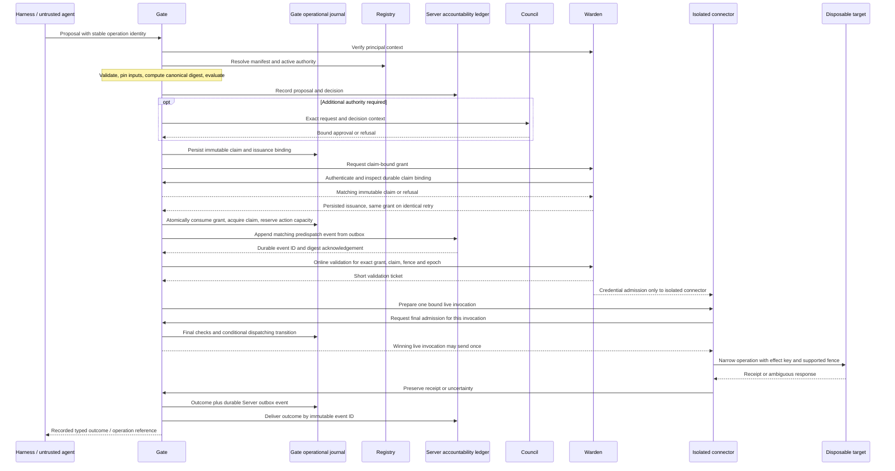

# Platform implementation boundaries

**Proposed architecture, based on platform plan revision 4, sections 3–5 and 16–22.**
The [plan](../platform-plan.md) preserves the founder's full rationale.
The nine component libraries currently contain interface declarations, not implementations.
The hub contains architecture and design documents; it has no Rust crate or runtime.

## Ownership

| Plane | Owner | Owns | Must not become |
|---|---|---|---|
| Agent | Harness | Proposal construction, client diagnostics, operation lookup | A security boundary or holder of target credentials |
| Mediation | Gate | Deterministic evaluation, claim journal, grant consumption, cumulative action reservations, isolated connectors | A governance ratifier or exactly-once external-effect promise |
| Mediation | Gateway | Model route controls and shared-budget admission/settlement | A second accounting implementation diverging from Server |
| Mediation | Server | Authoritative accountability records and governed memory | A way for ordinary writers to activate governance |
| Mediation | Matrix | Governed read-only structured evidence | A target-write path or an automatic low-consequence classification |
| Authority | Registry | Immutable inventory and effective activation pointers | A discovery-to-permission shortcut or live GitHub-backed policy database |
| Authority | Warden | Verified identity, grants, brokering and revocation | A new identity provider, vault or agent-visible secret source |
| Authority | Council | Exact-request approvals and governance lifecycle | A target executor or hidden bootstrap bypass |
| Assurance | Sentinel | Rebuildable timelines, coverage and bounded suspension requests | An authority restorer or substitute for local hard controls |
| Assurance | Assure | Portable evidence and independent verification | A compliance certification or proof that all events were true |
| Assurance | Console | Human views and calls to governed APIs | A privileged database administrator |

Process, network, storage and credential isolation are deployment obligations.
One host with several processes does not establish independent administration or
hardware isolation. Unmediated credentials and routes stay outside the claimed boundary.

## First complete action slice

This sequence follows proposed [ADR-0002](../decisions/0002-action-execution-protocol.md), not an
implemented integration. Gate owns the one local consumption/acquisition/reservation transaction;
there is no atomic transaction spanning Warden, Server and a target. Required predispatch Server
acknowledgement precedes the final journal admission to send. Recording occurs at each required
transition, not just at the end. [Action lifecycle](action-lifecycle.md) separates denied,
unsent, sent-but-no-effect, unresolved and recording-pending results. Compensation is a new action.

Decision-only Stage 1 stops before grant issuance and dispatch. An allow decision has no target
authority. REST is the first proposed Action API transport; MCP is an adapter with identical
semantics, and additional transports wait for conformance evidence.

## Shared semantics that must remain single definitions

- Gate computes the authoritative digest after validation; client hashes are untrusted input.
- Identity comes from verified evidence, including an explicit service origin when no human acts.
- Manifest and context determine consequence; a read can disclose restricted data.
- Approval binds request, policy/manifest context, evidence, expiry and relevant target state.
- A grant binds a durable claim, request, audience, scope and validity window; a signature alone
  does not supply atomic single-use behavior.
- Durable records preserve unresolved work and grant consumption through restart and restore.
- Action reservations survive ambiguity and window rollover; Gateway model budgets are separate.
- Actual enforcement mode and activation/recovery epochs bind authority and every event.
- Projections carry source IDs and coverage; missing intervals never imply a successful interval.

The [contract backlog](contract-backlog.md) names the decisions and consumers for each definition.
No executable schema, placeholder contract version or activated artifact is introduced here.

## State and trust

The Server accountability record links proposal, decision, authority, claim, dispatch and outcome.
Gate's journal is authoritative for operational claims, worker ownership, consumption and action
capacity; Warden owns issuance and revocation. Transactional outboxes link those states to Server
with idempotent durable acknowledgements. Ledger lag is exposed, and an unavailable required
predispatch acknowledgement stops a send. A worker lease expiry never establishes no effect.
Restore starts quarantined until old workers are fenced, records reconciled and a new protected
recovery epoch installed. ADR-0002's protocol remains proposed and needs real persistence tests.

Registry owns effective pointers, Council workflow, and Gateway accounting through the extracted
Server lineage. Sentinel and Console views are rebuildable. Assure exports pins, references,
omissions and trust context. GitHub documents, catalog state and CI results never activate policy.

Trust roots, host administrators, release configuration and signing custodians remain inside a
declared trust model. Two service accounts held by one administrator do not create two independent
human reviewers. A release requiring distinct human review waits for that evidence.

## Degraded-operation contract to implement

| Failure | Required behavior from plan section 22 |
|---|---|
| Council unavailable | No new approval/activation; existing authorized work still needs valid obligations and dependencies |
| Warden unavailable | No new grants or validation tickets; final dispatch needs valid online validation within the reference profile's measured bound |
| Server or mandatory journal unavailable | No new consequential dispatch requiring those records; preserve and recover in-flight uncertainty |
| Registry unavailable | Cached artifacts only within explicit freshness/revocation bounds; otherwise refuse |
| Sentinel unavailable | Hard authorization and budget checks remain; current-monitoring obligations stop affected actions |
| Connector timeout/process loss | Unknown effects remain unresolved; no blind redispatch |
| Uncertain clock or key validity | Time-sensitive authority fails closed |
| Target schema/API drift | Restrict or quarantine the affected connector until conformance returns |

The first reference profile proposes one cell to qualify with separate identities, authenticated channels,
durable storage, controlled egress and tested recovery. Local disposable fixtures establish only
their own boundary; cloud, offline and federated profiles need separate evidence. The proposed
[reference profile](reference-profile.md) makes the local topology and timing assumptions concrete;
the [reference scenario](reference-scenario.md) defines the acceptance observations. Harness is an
SDK, so eleven architectural components do not imply eleven independently deployed services.
