<!-- Public copy of the founder's platform plan. Content is carried verbatim from the
     source named below; only the document-export artifacts were repaired so that
     GitHub renders it. Tables from the export are kept as preformatted text. -->

> **About this document.** This is the Munarium founder's delivery plan for the Munarium
> Governance Platform, revision 4 of 28 September 2026, published here as the hub's planning
> baseline. It was moved from Ioka's private planning repository (source revision `860d43c`) after
> a publication review, as the plan's own Appendix B requires. Three things changed in the move:
> the export's page numbers, link markup and escapes were repaired and its tables are shown as
> preformatted text; the names of private repositories were replaced by the phrase "the private
> repository"; and the figures were redrawn from the plan's own diagrams as SVG sources with PNG
> renders under `images/`. The words are otherwise the source revision's.
> The plan describes intended work. Where it and a repository disagree about what exists, the
> repository's README and evidence are authoritative, and the component catalog in the hub
> [README](../README.md) records the current state.

**I O K A L L C · M U N A R I U M L A B**

Munarium\
Governance Platform

A Founder-Led Open-Source\
Architecture and Delivery Plan

The Munarium founder's journey from governed memory\
to governed action

```text
  ----------------------------------------------------------------------------
  **Author**       The Munarium founder, Ioka LLC
  ---------------- -----------------------------------------------------------
  **Publisher**    Ioka LLC · ioka.io

  **Date**         28 September 2026

  **Revision**     4 · Solo-founder and open-source strategy

  **Planning hub** iokaio/munarium-platform (public; created 28 September
                   2026)

  **Foundation**   Server 1.3.0 and Matrix 1.0.0, as described in the supplied
                   baseline

  **Status**       Founder review draft · Open-source development plan
  ----------------------------------------------------------------------------
```

One founder. Nine new open-source components.\
A shared architecture and a verifiable path to consequence.

The hub and the nine component repositories exist as public
skeletons, each with a license and a one-line README. Their
implementations and the migration of planning material remain planned.
Public source access, demonstrated controls, and enterprise readiness
are separate milestones.

## Contents

*Founder strategy, architecture, delivery evidence, and implementation appendices*

- [Executive perspective](#executive-perspective)
- [1. The founder's journey and the decision to continue alone](#1-the-founders-journey-and-the-decision-to-continue-alone)
- [2. An open-source strategy, not an unfunded staffing plan](#2-an-open-source-strategy-not-an-unfunded-staffing-plan)
- [3. The repository architecture](#3-the-repository-architecture)
- [4. Four powers and the controls around them](#4-four-powers-and-the-controls-around-them)
- [5. Four planes, one bounded guarantee](#5-four-planes-one-bounded-guarantee)
- [6. The development method: VCP and bounded coding agents](#6-the-development-method-vcp-and-bounded-coding-agents)
- [7. Munarium Registry: the inventory of governed capability](#7-munarium-registry-the-inventory-of-governed-capability)
- [8. Munarium Gate: the consequential action path](#8-munarium-gate-the-consequential-action-path)
- [9. Munarium Warden: identity without ambient authority](#9-munarium-warden-identity-without-ambient-authority)
- [10. Munarium Council: approval and governance activation](#10-munarium-council-approval-and-governance-activation)
- [11. Munarium Harness: the easiest correct path](#11-munarium-harness-the-easiest-correct-path)
- [12. Munarium Gateway: the model path and its budget](#12-munarium-gateway-the-model-path-and-its-budget)
- [13. Munarium Sentinel: operational evidence and bounded response](#13-munarium-sentinel-operational-evidence-and-bounded-response)
- [14. Munarium Assure: evidence that can be checked elsewhere](#14-munarium-assure-evidence-that-can-be-checked-elsewhere)
- [15. Munarium Console: one interface, no hidden privilege](#15-munarium-console-one-interface-no-hidden-privilege)
- [16. The foundation: Server and Matrix extensions](#16-the-foundation-server-and-matrix-extensions)
- [17. The governed action lifecycle](#17-the-governed-action-lifecycle)
*Founder strategy, architecture, delivery evidence, and implementation appendices*

- [18. Consequence classes and provenance-aware policy](#18-consequence-classes-and-provenance-aware-policy)
- [19. Governance changes and the policy toolchain](#19-governance-changes-and-the-policy-toolchain)
- [20. Supporting systems without nine more services](#20-supporting-systems-without-nine-more-services)
- [21. Adoption across different enterprise journeys and stacks](#21-adoption-across-different-enterprise-journeys-and-stacks)
- [22. Deployment, federation, and degraded operation](#22-deployment-federation-and-degraded-operation)
- [23. Six projected enterprise uses, beginning with a founder-scale proof](#23-six-projected-enterprise-uses-beginning-with-a-founder-scale-proof)
- [24. Threat model, verification, and release integrity](#24-threat-model-verification-and-release-integrity)
- [25. The founder-led roadmap](#25-the-founder-led-roadmap)
- [26. Sustainability, community, and founder continuity](#26-sustainability-community-and-founder-continuity)
- [27. The outcome the founder intends to build](#27-the-outcome-the-founder-intends-to-build)
- [Appendix A. Acknowledgment and a small research suggestion](#appendix-a-acknowledgment-and-a-small-research-suggestion)
- [Appendix B. Repository migration and first-commit checklist](#appendix-b-repository-migration-and-first-commit-checklist)
- [Appendix C. Initial invariant and acceptance catalog](#appendix-c-initial-invariant-and-acceptance-catalog)
- [Appendix D. Illustrative contracts and release composition](#appendix-d-illustrative-contracts-and-release-composition)
- [Appendix E. Standards alignment and remaining responsibility](#appendix-e-standards-alignment-and-remaining-responsibility)
- [Appendix F. Working glossary](#appendix-f-working-glossary)
- [Appendix G. Sources, attribution, and access notes](#appendix-g-sources-attribution-and-access-notes)
- [Appendix H. Source-to-revision map](#appendix-h-source-to-revision-map)
- [Appendix I. Matrix consolidation and the 1.2.0 release](#appendix-i-matrix-consolidation-and-the-120-release)
## Reading guide

For implementation preparation derived from this historical plan, use the current
[build guide](build-plan.md), [architecture index](architecture/README.md) and
[decision index](decisions/README.md). The hub remains documentation-only; the nine
component repositories now carry Rust interface scaffolds. These preparation artifacts
do not establish runtime capabilities, contract releases or a qualified composition.
The historical plan text below retains its source baseline.

For the dated phase-2 source observations, already changed Matrix repository layout, and revised
delivery gates, use the [current-status crosswalk](architecture/foundation-baseline.md#historical-plan-crosswalk).
Do not execute the historical migration checklist as new work without checking that record.

Sections 1--6 explain the founder's strategy and development method.
Sections 7--20 define the components and shared controls. Sections
21--26 address adoption, operational risk, sequencing, and
sustainability. The appendices provide attribution, repository
checklists, test invariants, and source traceability.

# Executive perspective

The Munarium founder's plan for the Munarium Governance Platform begins
with the practice that produced its foundation: one founder, assisted by
coding agents and multiple models, retaining responsibility for
architecture, verification, and release decisions. He proposes to build
a sequence of independently useful, publicly inspectable capabilities
whose integration becomes a governed enterprise platform.

The earlier plan assumed parallel delivery by a funded team and possible
open-core editions. This revision assumes no recruiting period or
financing event before development begins. Each of the nine proposed
components now has a public repository, created as a license-and-README
skeleton. Their architecture, contracts, and roadmap will be coordinated
through **iokaio/munarium-platform**, the public architecture hub.
Moving reviewed planning material into that hub from the private
repository remains a planned action.

Server and Matrix remain the foundation. The supplied September 2026
paper describes Server 1.3.0 and Matrix 1.0.0 as released software and
identifies their required extensions. Those descriptions are a source
baseline, not a fresh audit of current branches. The nine additional
components remain proposed until tagged implementations and evidence
justify a stronger label. [1]

The founder's central position remains intact: agents may reason, gather
evidence, and propose changes, but their ordinary operating identity
must not activate the rules governing them. The platform separates
memory, action, authority, and assurance without claiming to make models
infallible or control unmediated paths. His exchange with Jamey Kistner
helped sharpen the authority question; Appendix A acknowledges the
research and proposes a small boundary-test exercise. [2, 4, 5]

The governing delivery rule. Every stage must be useful and honest
within its stated boundary. Missing authority, unavailable evidence,
incomplete credential isolation, or an unqualified connector must narrow
the release, not become a reason to waive a control.

The proposed twelve-month target is a coherent, single-cell reference
platform: public code for all nine components, a reproducible local
installation, selected qualified integrations, and a documented path
from proposal to independently authorized effect. It is not a promise of
broad multi-cloud general availability or six founder-operated
production accounts. Public access begins with the repositories;
readiness advances through evidence-based release gates.

VCP is the intended primary work environment, with Claude Code, Codex,
and other agents available when appropriate. These tools assist
implementation and review; they do not authorize releases. The founder
remains the sole required builder and maintainer. Optional reviewers,
sponsors, contributors, and deployment partners are not counted as
uncommitted delivery capacity. Their involvement can strengthen the
project without becoming a prerequisite to publishing useful work.

# 1. The founder's journey and the decision to continue alone

## 1.1 A platform that grew from a practical problem

The founder's work on long-form writing and later governed memory
provides the personal context for this plan. The continuity between
those efforts is not that every later component was obvious at the
beginning. It is that useful AI work repeatedly creates a need to
preserve context, distinguish supported claims from plausible language,
and retain the evidence behind a change. The platform is the next
architectural response to that problem, not a claim that the original
writing work began as a complete enterprise-governance strategy.

In the planning exchange behind this revision, the founder states that
he created the work himself with the help of Claude Code, Codex, and
multiple models. That account matters to the delivery model. Solo,
AI-assisted construction is his existing working practice, rather than
an untested organizational slogan. It establishes a credible starting
point, but it does not by itself establish the time needed to qualify a
security-sensitive, multi-component platform. [3]

Munarium's governed-memory foundation addresses accepted claims,
disputes, supersession, provenance, historical state, and the rules
under which writes were evaluated. The companion position paper then
makes the next boundary explicit: a reliable memory layer cannot
neutralize an unrestricted production credential in the surrounding
application. The evidence plane and the authority to create effects are
different responsibilities. [1, 2]

For the founder, the practical conclusion is that better models do not
remove the need for better architecture. A coding agent can help
implement an authorization service without receiving the authority to
replace its active production policy. An assistant can draft a payment
while the payment credential remains elsewhere. A deployment planner can
assemble evidence without becoming its own approver.

## 1.2 The founder's role in an AI-assisted organization of one

The founder will own architecture, scope, repository stewardship,
integration decisions, and the final acceptance of changes. Coding
agents will perform bounded implementation, investigation, test
generation, documentation, and review tasks. Work will be decomposed so
that an agent's output is inspectable and a failed task can be discarded
without corrupting an entire release.

The scarce resource is therefore not code generation alone. It is
founder attention: the time required to choose a sound design, inspect a
difficult change, investigate an ambiguous failure, maintain the
existing foundation, and respond to adopters. The plan limits concurrent
implementation so that agent throughput does not create a review backlog
larger than the founder can responsibly resolve.

His personal perspective will remain visible through explicit design
choices: which boundaries matter, which integrations can wait, which
claims require evidence, and when a release should remain experimental.
Those judgments are the founder's proposed direction, not externally
validated facts about a finished product.

## 1.3 What this revision changes

```text
  -----------------------------------------------------------------------
  Earlier planning       The founder's revised decision
  assumption
  ---------------------- ------------------------------------------------
  A funded team begins   Development continues with one founder;
  after capital and      fundraising is optional and must not become a
  recruiting are         six-month dependency.
  secured.

  Several product        One main capability slice advances at a time,
  workstreams advance in with a small maintenance lane and bounded agent
  parallel.              sub-tasks.

  Enterprise editions    All nine new components and their Ioka-authored
  may contain advanced   platform features are planned as open source
  platform code.         from their first public commits.

  The planning           The public hub is munarium-platform,
  repository is framed   coordinating the entire platform rather than a
  as an                  proprietary edition.
  enterprise-edition
  hub.

  Broad enterprise       A qualified reference stack and repeatable
  launch and six         adopter experience define the initial product
  supported deployments  milestone. Six evaluations remain an outreach
  define success.        aspiration, not six support obligations.

  Architectural diagrams Every release states its actual trust boundary,
  can imply uniform      deployment assumptions, unsupported paths, and
  guarantees.            residual risks.
  -----------------------------------------------------------------------
```

The revision also adds implementation clarifications. A single-use
platform grant is not automatically a single-use credential at a legacy
target. A read can disclose sensitive data and is not automatically low
consequence. A replay reproduces a recorded deterministic decision, not
a model's private reasoning or every future model response. These
clarifications qualify the earlier paper's shorthand without changing
its four-plane architecture.

# 2. An open-source strategy, not an unfunded staffing plan

## 2.1 Public from the beginning

The nine repositories currently contain an Apache-2.0 license and a
one-line README. Before code lands, each will add architecture, threat
assumptions, a capability-status table, tests or test specifications,
and a useful first work item. A repository may initially contain a
design and a conformance harness rather than a functioning service. Its
README must make that distinction unmistakable. Public availability of a
skeleton is not a release claim.

The founder's default licensing proposal is Apache-2.0 for new
Ioka-owned implementation code, tests, examples, and repository
documentation. The actual license files and ownership review must be
completed before publication. Existing dependencies, imported code,
research material, and previously contributed assets retain their
applicable terms. Open sourcing a new repository does not automatically
relicense material copied into it. [7]

The revised strategy removes code-based Community versus Enterprise
boundaries for the planned components. Council workflows, Assure
tooling, federation implementation, deployment automation, and
Ioka-authored adapters will not be reserved for a future closed edition.
Some capabilities will be delivered later because they require time,
access, or review. **Deferred is a roadmap state, not a commercial
restriction.**

Open source does not require publication of customer records, live
credentials, confidential assessments, or unremediated vulnerability
details. Public development will coexist with private vulnerability
intake and protected signing material. Historical confidential documents
and repository history will receive a publication review rather than
being pushed into a public repository without inspection.

## 2.2 What openness should accomplish

The founder expects source availability to lower the cost of technical
evaluation. An architect should be able to inspect an action contract,
run a denial test, see the code that checks an approval, and reproduce
the decision trace locally. The strongest distribution asset will be a
small working example whose control boundary can be tested, not a large
diagram whose boxes remain hypothetical.

The strategy also makes the platform's limitations visible. A connector
can expose its declared scopes, failure modes, and test evidence. A
release can show which authority checks are implemented and which are
not. Independent teams can evaluate those claims without relying solely
on the founder's explanation.

These are intended advantages, not assumptions that contributors,
enterprise users, or sponsors will arrive automatically. The critical
path contains only work the founder can perform or work for which a
reviewer or sponsor has explicitly committed resources. Community
contributions are welcome additional capacity; they are not invisible
headcount in the schedule.

## 2.3 Commercial options without a closed code path

Ioka may offer bounded architecture reviews, implementation assistance,
training, sponsored development, and support contracts consistent with
actual capacity. A sponsor can fund a connector or an independent
review, but the resulting Ioka-owned platform implementation remains
public. Customers would be paying for expertise, delivery commitments,
operation, or assurance services, rather than permission to inspect or
use essential controls.

A managed service remains optional future work. It would add operational
and contractual duties that the solo plan does not assume. Likewise, a
support badge or conformance report must describe the scope of testing
and the party responsible; it cannot imply a general security
certification.

The founder will retain a narrow support boundary during the first year:
asynchronous community assistance, reproducible issue reports,
documented reference configurations, and a limited number of scheduled
design-partner sessions. Enterprise production operation remains the
adopting organization's responsibility unless a separate, sustainable
agreement explicitly says otherwise.

Founder decision. The first commercial constraint is capacity, not a
paywall. No sales objective should require the founder to imply
around-the-clock coverage, independent dual-human review, or a breadth
of certified integrations that the project does not possess.

# 3. The repository architecture

## 3.1 One hub, nine new component repositories

The architecture hub is **iokaio/munarium-platform**, a public
repository described as "the central architectural design hub for
Munarium Governance Platform." It will carry the shared explanation of
the platform, the roadmap, cross-component decisions, normative
interface specifications, integration recipes, and evidence for a
tested composition. It will not
become a twelfth runtime component, a remote production-policy
dependency, or a duplicate implementation of the component repositories.

The migration source is a private Ioka repository, referred to here as
the private repository. It was not publicly retrievable during earlier
preparation because it is private. It currently holds this plan, the
Enterprise plan, and five out-of-tree Matrix adapters. The hub was
created as a new repository rather than by renaming it. The private
repository remains private, and planning material moves into the hub
only after review. Appendix B defines the migration checklist.

```text
+-----------------------------------------------------------------------------+
| **iokaio/munarium-platform · Architecture • contracts • roadmap •           |
| composition evidence**                                                      |
+=========================+=========================+=========================+
| **REGISTRY**            | **HARNESS**             | **WARDEN**              |
|                         |                         |                         |
| munarium-registry\      | munarium-harness\       | munarium-warden\        |
| Inventory and manifests | Agent SDKs              | Identity and grants     |
+-------------------------+-------------------------+-------------------------+
| **GATE**                | **GATEWAY**             | **COUNCIL**             |
|                         |                         |                         |
| munarium-gate\          | munarium-gateway\       | munarium-council\       |
| Decide and enforce      | Model-call mediation    | Approve and ratify      |
+-------------------------+-------------------------+-------------------------+
| **SENTINEL**            | **ASSURE**              | **CONSOLE**             |
|                         |                         |                         |
| munarium-sentinel\      | munarium-assure\        | munarium-console\       |
| Observe and suspend     | Control mapping and     | Approver, operator, and |
|                         | evidence packs          | auditor interface       |
+-------------------------+-------------------------+-------------------------+
| **Existing foundation: Server (iokaio/munarium) + Matrix                    |
| (iokaio/munarium-matrix after the move) \| Development tooling: VCP         |
| (iokaio/vcp) + other agents**                                               |
+-----------------------------------------------------------------------------+
```

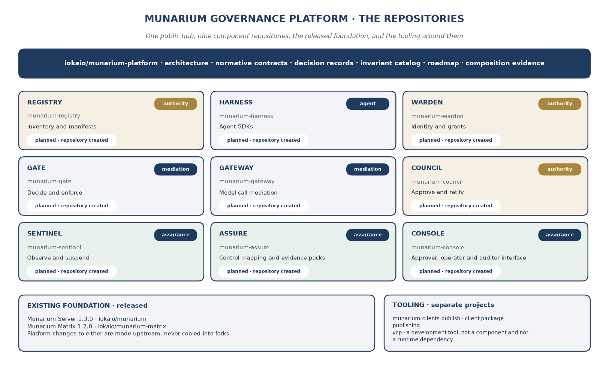

*Figure 1. The architecture hub coordinates nine independent component repositories, shown with their published GitHub descriptions. The foundation and VCP remain separate projects.*

Server and Matrix currently share the public **iokaio/munarium**
repository, which holds server/, matrix/, and clients/. Matrix will
move out of it in two phases (section 16.5 and Appendix I). First, the
service, its contract, and its .NET, Java, and Python client libraries
move to the public **iokaio/munarium-matrix** repository at their
current versions. Only after that move is complete do the service and
every client advance to Munarium Matrix 1.2.0. The new repository
exists but has no commits yet, so iokaio/munarium remains the Matrix
source of record until the move's cutover. Server stays in
iokaio/munarium. Platform changes to either will be made upstream
rather than copied into new forks. VCP (**iokaio/vcp**, "Vibe Code Pro
- An Experiment") also remains a separate development tool, not one of
the nine proposed platform components and not a required runtime
dependency for adopters.

## 3.2 What belongs in the hub

The hub will contain a component catalog, architecture decision records,
threat models, a shared glossary, contract schemas, golden test vectors,
milestone definitions, and integration-level acceptance tests. A
composition manifest, provisionally named **platform-lock.yaml**, will
identify the exact component versions and artifact digests used in a
tested platform release.

The manifest will also identify contract versions, policy-schema
versions, database migration requirements, supported deployment profile,
and links to build and acceptance evidence. A platform release means
that a specific set of independently versioned components was tested
together. It does not mean that every repository has the same version
number or that a floating main branch is a compatible production
composition.

The hub's contracts directory is the normative source for wire envelopes
and cross-component semantics. Runtime libraries remain with an owning
component or the existing foundation repository. For example, a factored
execution-journal library should have one owner and one versioned
release source, not slightly different copies in Gate and Server.
Generated bindings may be published by Harness, but their generation
must identify the contract digest.

Planning documents can be updated through normal reviewed development.
Activated runtime policies cannot. The hub publishes artifacts and
decisions; a deployed Registry or Council accepts only artifacts that
pass the deployment's own admission and authority checks. GitHub
availability must not determine whether an already installed control can
execute a pinned policy.

## 3.3 What belongs in each component repository

Each component will include its implementation, unit and component
tests, migrations it owns, operational diagnostics, package definitions,
a local development recipe, and release evidence. Its README will state
the current capability tier, supported contract versions, external
dependencies, and unsupported use cases.

Common files will include LICENSE, NOTICE where applicable, SECURITY.md,
CONTRIBUTING.md, SUPPORT.md, CHANGELOG.md, an AI-assistance disclosure
convention, and a component-specific AGENTS.md. The shared invariant set
will be referenced by version from the hub. Component instructions may
narrow permitted work; they may not silently redefine platform
contracts.

Every release will be pinned to an immutable source revision. Containers
and packages will expose source provenance and a software bill of
materials. The first implementation will favor a small number of release
formats. Maintaining five packaging systems before the core action path
works would consume the founder's attention without improving the
platform's guarantee.

## 3.4 Controlling the cost of multiple repositories

Nine repositories create real coordination work. The founder will
address that cost with a reusable repository template, a shared CI
convention, machine-checked contract compatibility, and an integration
job that consumes a proposed platform-lock change. A cross-repository
feature will have one hub issue linking its component issues, required
order, test fixtures, and acceptance evidence.

Breaking interface changes will use an expand, migrate, and remove
sequence wherever feasible. A producer first adds a compatible
capability, consumers adopt it, the platform composition records the
transition, and only then can an obsolete contract be removed under the
declared version policy. Agents may prepare coordinated pull requests,
but they may not treat successful changes in one repository as
permission to merge unverified changes elsewhere.

# 4. Four powers and the controls around them

## 4.1 The distinction the founder intends to preserve

The source paper separates read, governed write, act, and govern. That
separation remains the conceptual center of the platform. A principal
may be permitted to submit a memory claim without being permitted to
activate its governance profile. A principal may propose an external
action without possessing the target credential. A service may execute
an approved request without holding the power to approve a broader one.
[1, 2]

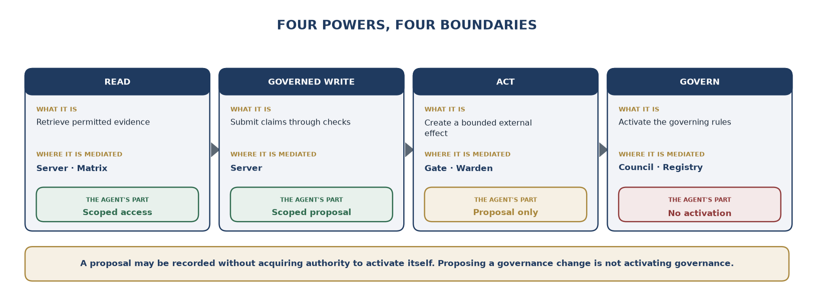

Figure 2. The agent can read and propose within scope. Consequential
execution and governance activation cross distinct authority boundaries.

The founder's revised formulation distinguishes **proposing a governance
change** from **activating governance**. An agent can submit an inert
proposal through a narrow intake surface. That does not make the agent a
writer to the active authority state. The Registry's effective
manifests, Council's ratification state, trust roots, and Server's
active governance transitions remain outside the agent's ordinary
authority.

Separating credentials is necessary but not always sufficient. Two
credentials controlled by the same person do not create two independent
human reviewers. Two services sharing an unrestricted administrator or
execution account are not independent merely because their process names
differ. A deployment must describe who can actually alter each boundary,
including the host, CI configuration, signing policy, database roles,
and recovery procedures.

## 4.2 Principles retained from the source

```text
  -----------------------------------------------------------------------
  Principle              Consequence for the founder's implementation
  ---------------------- ------------------------------------------------
  Agent code is          Harness and prompts provide convenience;
  untrusted.             enforcement resides outside the agent process
                         and privilege domain.

  Controls sit on        A direct credential, network route, shell, or
  consequential paths.   vendor connector outside mediation is a
                         documented bypass.

  The four powers remain Agent identities cannot ratify, mint target
  separate.              grants, or activate their own rules.

  Default deny and fail  Unknown manifests, unverifiable approvals,
  closed.                missing mandatory evidence, and policy errors do
                         not produce permission.

  Decisions are          The decision engine receives a pinned input
  reproducible.          bundle and a recorded engine and policy version.

  Target secrets stay    A workload token used to authenticate the agent
  outside agent          is distinguished from a credential capable of
  visibility.            acting directly on a target.

  Provenance influences  Cited evidence is verified; missing lineage is
  policy.                unknown, not implicitly authoritative.

  One authoritative      Operational caches and indexes are allowed, but
  accountability record  they are rebuildable projections rather than
  exists.                competing histories.

  Activated artifacts    Corrections, supersession, rollback, and
  are immutable.         revocation append explicit new records.

  Mature infrastructure  Munarium does not become another identity
  is integrated.         provider, secrets vault, ticketing suite, or
                         SIEM.

  Authority semantics    Different stacks implement the same contracts;
  are portable.          qualification of one stack does not establish
                         qualification of every stack.
  -----------------------------------------------------------------------
```

These principles are requirements for the proposed platform. They are
not claims that every source release or future connector already meets
them. The founder will use executable invariants to connect each
requirement to an implementation and a release decision.

## 4.3 The solo-founder authority boundary

During development, the founder can authorize an agent-originated change
through a separate human-controlled release path. The agent cannot
possess the release credential, modify the trusted approval workflow, or
replace the test baseline used to judge its own change. That is
meaningful separation between the coding agent and the founder.

It is not independent human oversight of the founder. If he designs,
writes, reviews, and releases a change himself, the record must say so.
A second model's review is additional analysis, not a second accountable
person. For a change whose risk policy requires independent human
review, the release must obtain that review or remain outside the
corresponding production claim.

Enterprise deployments can appoint their own approvers, security
administrators, and recovery custodians. Those customer roles do not
become Ioka employees and are not resources for building the platform.
The software should support stronger separation than the founder's own
one-person organization can demonstrate internally.

# 5. Four planes, one bounded guarantee

## 5.1 Reference architecture

The platform retains the source's four planes: agent, mediation,
authority, and assurance. These are responsibility and trust boundaries,
not a requirement for eleven separate hosts. A small reference
deployment may run several services on one machine while keeping
processes, credentials, network permissions, and storage roles separate.
Such a deployment must not claim hardware-isolated independence. [1]

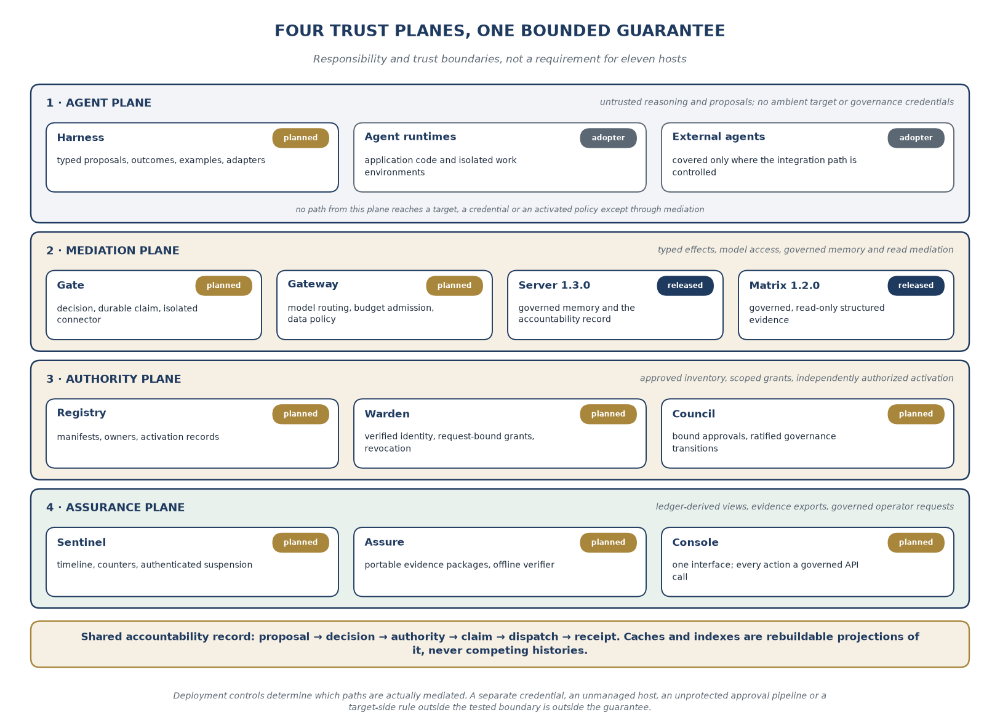

Figure 3. Four trust planes compose the platform. Deployment controls
determine which paths are actually mediated.

The agent plane contains application runtimes, Harness adapters, and
isolated work environments. Its code can reason and propose. It cannot
inherit cloud administrator credentials, read broker secrets, edit
active policy bundles, or use an unrestricted network route to reach a
consequential target. External SaaS agents receive the same treatment
where the enterprise can actually control the integration path;
otherwise the uncovered capability remains outside the platform's
assurance boundary.

The mediation plane contains Gate for actions, Gateway for model calls,
Server for governed memory, and Matrix for governed reads. A model call
can itself be consequential because it moves data or consumes a budget.
Likewise, a read can disclose data or reveal a restricted record. The
release must authorize those paths according to their actual
consequence, not merely their HTTP method.

The authority plane contains Registry, Warden, and Council. Registry
identifies approved artifacts and owners. Warden authenticates the
acting chain and brokers execution authority. Council accepts approvals
and activates changes through separate authority. No ordinary agent
credential can modify their effective control state.

The assurance plane contains Sentinel, Assure, and Console. These
components read authoritative records and may hold rebuildable views.
When an operator uses Console to approve, revoke, or suspend, Console
calls the same Council or Warden API as any other authorized client. The
interface is not a hidden administrative bypass.

## 5.2 Principal flows

```text
  ------------------------------------------------------------------------
  Flow             Mediated path                Required authority and
                                                record
  ---------------- ---------------------------- --------------------------
  Model invocation Agent to Gateway to provider Allowed endpoint, data
                                                policy, budget admission,
                                                invocation record

  Memory read or   Agent to Server              Scoped identity,
  claim                                         compartment checks,
                                                governed-write findings

  Enterprise query Agent to Matrix to source    Verified query contract,
                                                source authorization,
                                                sealed evidence

  External action  Agent to Gate to isolated    Decision, obligations,
                   connector to target          durable claim, Warden
                                                grant, receipt or
                                                unresolved state

  Governance       Agent or human to proposal   Inert candidate only; no
  proposal         intake                       activation privilege

  Governance       Authorized ratifier to       Distinct authority,
  activation       Council to Registry or       artifact digest, version
                   Server                       checks, recorded
                                                transition

  Operational      Sentinel or authorized       Pre-authorized suspension
  suspension       operator to Warden           policy; authenticated
                                                request and revocation
                                                evidence
  ------------------------------------------------------------------------
```

## 5.3 Where the guarantee ends

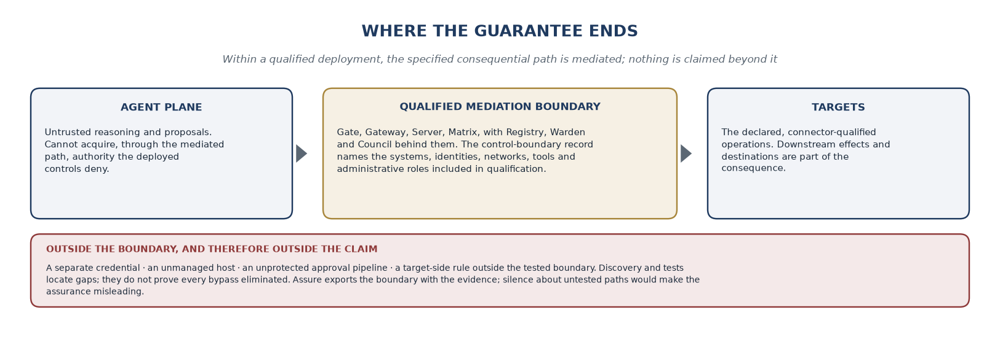

The founder's guarantee is deliberately conditional: within a qualified
deployment, the specified consequential path is mediated and the agent
cannot acquire authority through that path that the deployed controls
deny. A separate credential, an unmanaged host, an unprotected approval
pipeline, or a target-side rule outside the tested boundary can
invalidate that claim.

Discovery and tests help locate those gaps; they do not prove that all
possible bypasses have been eliminated. A deployment's control-boundary
record must identify the systems, identities, networks, tools, and
administrative roles included in qualification. Assure will export that
boundary along with the positive evidence. Silence about untested paths
would make the assurance misleading.

# 6. The development method: VCP and bounded coding agents

## 6.1 A toolchain, not another authority

The founder intends VCP to organize repository-aware work, retained
context, model selection, visible delegated tasks, and cost accounting.
The public repository describes those intended capabilities and
distinguishes its implemented foundation from its unreleased product
scope. The execution plan therefore requires local qualification of the
particular VCP build being used; it does not infer readiness from the
project name or from the founder's progress estimate. [6]

Claude Code, Codex, and other coding agents remain available as
alternatives. Their use does not change repository ownership, contract
versions, test obligations, or release authority. Work must be portable
between tools through checked-in specifications, issues, reproducible
scripts, and evidence. VCP should reduce friction, not become a single
dependency capable of stopping all platform development.

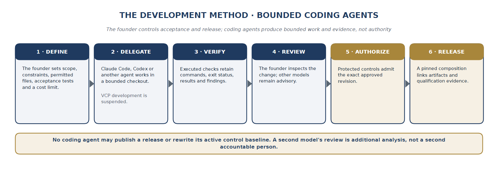

Figure 4. The founder controls acceptance and release. Coding agents
produce bounded work and evidence, not authority.

## 6.2 The work packet

A work packet will identify the repository and revision, the problem, an
approved design or a bounded design question, permitted files,
interfaces that must not change, acceptance tests, and a time or
model-spend limit. Security-sensitive tasks will also identify forbidden
effects: release publication, policy activation, credential changes,
modifications to protected workflows, or mutation of the reference test
baseline.

Agents will receive the minimum context and permissions needed for the
packet. Implementation and adversarial review may use different models,
but both remain advisory. The founder will inspect the change and its
evidence before merging. A model's statement that tests passed must
point to actual commands, exit status, and retained output, not a
narrative summary alone.

The accepted record will link the original requirement, the design
decision, source revision, model-assisted changes, relevant findings,
and executed checks. Sensitive prompts or customer data will not be
published simply because the development process is transparent. A
public evidence summary can identify a private test's scope and reviewer
without exposing protected material.

## 6.3 Limits on parallel work

The starting work-in-progress limit is one major capability slice, one
maintenance lane for released software, and no more than two bounded
agent implementation tasks awaiting substantive review. That limit is a
planning choice, not an inherent limit of VCP. The founder can revise it
after measuring review delay, integration failures, and rework.

Security or protocol decisions that affect several repositories will be
resolved in a hub decision record before parallel implementation begins.
Agents should not independently invent slightly different grant
semantics, principal-chain rules, or request hashes. Where exploration
is necessary, candidate branches will be labeled experiments and kept
out of release composition.

A weekly review will close or split oversized packets, reconcile the
work ledger, and update the next acceptance milestone. The founder will
reserve time for reading the code that generated tests are supposed to
constrain. Increased test volume is useful only when the tests address
the required property and their oracle has not been generated from the
same mistaken assumption.

## 6.4 Measuring leverage and containing recursion

The founder will track model spend per accepted change, founder review
hours, rework, escaped defects, security findings, restore success, and
elapsed time to a useful capability. Comparisons will use similar task
classes and disclose the sample size. No blanket twofold or fourfold
productivity assumption is required by this plan.

VCP's own changes will be built and qualified separately from the
platform release they help produce. A running agent must not upgrade its
own active enforcement code or silently change the controls around its
current task. Candidate VCP changes can be tested in a separate checkout
and promoted through the founder's human-controlled path. A tool can
help build its successor without ratifying that successor.

The plan's first internal example is therefore narrow and testable: a
coding agent may prepare a patch and propose a release, while a
protected pipeline builds the exact approved revision and a separate
authority controls publication. That example exercises the platform's
philosophy without pretending that the platform has already secured all
of its own development infrastructure.

# 7. Munarium Registry: the inventory of governed capability

**Repository: iokaio/munarium-registry** (public skeleton: "Inventory of
agents, tools, manifests, and policy bundles"). Registry belongs to the
authority plane. The founder will use it to make the inventory
executable: the same artifact that describes a tool's intended scope
must constrain what Gate will accept. The initial implementation favors
a small signed catalog over a broad discovery portal.

## 7.1 The first implementation

Registry will store immutable agent definitions, tool manifests,
policy-bundle references, owners, and activation records. An agent
definition will identify purpose, release, deployment class, permitted
tools, model allowances, consequence limits, and a responsible human or
organizational owner. Discovery may create candidate records, but
discovered does not mean approved.

A tool manifest will identify a versioned argument schema, target and
environment, base consequence class, upward-only modifiers, effect
semantics, permitted credential audience, idempotency behavior,
compensation options, data classifications, and required obligations.
The manifest must describe the actual target operation, not just a
friendly tool name. A connector that silently executes broader
operations than its manifest advertises fails qualification.

The first interface will support resolving an immutable artifact by
digest, listing capabilities allowed for a principal, and reporting the
effective artifact version for a deployment. Read APIs are distinct from
candidate submission and activation. A narrowly scoped candidate-intake
endpoint may accept an agent's proposed manifest without changing the
catalog used for enforcement.

## 7.2 Activation and distribution

The founder will separate artifact publication from activation. CI may
build and sign a candidate bundle; Council or the temporary bootstrap
authority determines whether a deployment may activate it. Registry
validates the attestation, expected prior state, tenant, environment,
and target artifact digest before changing the effective pointer. The
old artifact remains available for historical reconstruction.

A running Gate may cache a verified bundle within a declared freshness
window. The cache must include its activation epoch and revocation
status, not merely the content hash. Immutability of a manifest does not
make it permanently authorized. A retired tool can still have authentic
bytes while no longer being allowed.

The hub repository is not Registry's live database. Deployed catalogs
will consume released artifacts through an authenticated installation or
promotion path. A GitHub outage must not rewrite policy semantics, and a
compromised documentation branch must not become permission to activate
new runtime capability.

## 7.3 Verification and solo scope

```text
  -----------------------------------------------------------------------
  Required check         Acceptance evidence
  ---------------------- ------------------------------------------------
  Unknown, unsigned, or  Gate refuses them with a typed reason and a
  mismatched artifacts   recorded decision.

  Same identity with     Registry rejects replacement; a new version is
  different bytes        required.

  Agent-originated       The active catalog remains unchanged.
  activation attempt

  Stale expected         A conflict is returned rather than overwriting a
  activation state       newer decision.

  Retired manifest in a  Freshness or revocation rules prevent
  local cache            unauthorized continued use.

  Broad imported API     Import produces a candidate surface requiring
  description            explicit review, not automatic trust.
  -----------------------------------------------------------------------
```

Full cloud discovery, organizational asset synchronization, and a large
catalog UI are deferred. Registry's first value is a trustworthy
manifest and owner inventory that Gate can use. The founder will build
discovery around that contract rather than expanding the contract around
every source system.

# 8. Munarium Gate: the consequential action path

**Repository: iokaio/munarium-gate** (public skeleton: "Policy decision
and enforcement point for every tool call"). Gate is the largest new
component and the main technical risk. The founder will develop it as
three explicit subsystems: deterministic evaluation, durable execution
state, and an isolated connector host. They may share a release
repository, but they must not share unrestricted privileges merely for
convenience. [1]

## 8.1 Decision engine

The engine resolves the signed manifest, validates the canonical
request, verifies the principal chain, enriches the request with
recorded context, computes the consequence class, and returns allow,
deny, or approval-required with obligations. An unavailable mandatory
input is not replaced by the model's explanation of what it probably
contains.

The initial release will use one policy evaluator. The source paper
favors exploring Cedar and OPA/Rego; the founder's plan retains an
evidence-based selection rather than supporting both immediately. A
short implementation spike will compare required policy expressiveness,
determinism controls, schema handling, integration cost, resource
limits, and testability. The resulting decision record will identify the
chosen engine and version. The language name alone is not a proof of
correctness.

External enrichment is separate from evaluation. A current entitlement,
verified vendor record, classification label, or change-freeze flag is
retrieved through an authenticated source and retained in the input
bundle with its source version and freshness information. The evaluator
receives those inputs; it does not make unrecorded network calls during
the decision.

## 8.2 Durable execution

An allowed decision is not an execution. Gate first records the
proposal, decision, satisfied obligations, and a durable execution
claim. The claim binds the tenant, semantic operation identity, target,
canonical request hash, and approved execution scope. Warden may then
issue a grant for that claim.

The execution worker must atomically acquire the claim and consume the
grant under the supported storage protocol. Parallel workers cannot each
treat the same grant as unused. A fencing value or equivalent ownership
mechanism prevents a worker that lost its lease from dispatching after
another worker has taken over. Recovery tests will include crashes
before dispatch, after dispatch, and before receipt persistence.

The platform does not promise exactly-once external effects. A remote
system can apply a request and lose the response. Gate must preserve the
resulting ambiguity and stop blind repetition. A target's idempotency
support can improve recovery, but its documented scope, retention
period, and behavior must be part of the connector contract.

## 8.3 Connector isolation

A connector may receive the narrow credential needed to execute an
approved request. The agent must not. Connectors will run with separate
identities and bounded network access, preferably grouped by target and
credential domain. The initial reference connector will target a
disposable local service so that fault injection does not endanger real
enterprise records.

Generic shell, unrestricted HTTP, arbitrary SQL, and unbounded
file-writing tools will not be exposed as low-risk enterprise
capabilities. A development sandbox may legitimately contain a shell,
but that shell must not carry production authority. A broad tool
approved for a special environment requires an explicit,
high-consequence boundary and does not become safe merely because its
description appears in Registry.

Connector execution must also constrain redirects, target resolution,
payload size, attachment references, and environment selection. A
request approved for one endpoint must not follow an attacker-controlled
redirect to another endpoint with the same credential. Target identity
is part of authorization, not a transport detail.

## 8.4 Interfaces and first release

The native Action API is the canonical contract. MCP is an adapter to
that contract, not a privileged second execution path. REST will be the
first direct interface, with gRPC and additional transport support added
only after shared semantics have contract tests. The MCP adapter will
follow the supported authorization specification and reject
inappropriate token forwarding. [8]

Gate's first public increment is decision-only evaluation and replay
against a fake target. It must clearly report that no production action
path is qualified. Its first effect-producing release requires the
minimum Registry, Warden, durable record, and distinct approval path
needed by the chosen consequence class. A partially implemented Warden
is not replaced by handing a service account to the agent.

The source's 10 ms decision and 25 ms provenance p99 figures remain
exploration targets, not launch promises. The founder will publish
end-to-end measurements with workload, hardware, cache conditions,
concurrency, and required durable writes. A fast evaluator is not the
same as a fast governed action.

## 8.5 The release proof

Gate qualification will include request substitution, stale approvals,
concurrent grant use, invalid principal chains, policy errors,
mandatory-recording failure, connector compromise simulations, and
unknown target outcomes. Each failure case must produce the correct
refusal or unresolved state and preserve evidence without leaking
secrets.

A release is ready for a stated reference use case when an adopter can
independently run its conformance suite and reproduce both the allowed
action and the prohibited alternatives. The objective is not a
demonstration that a friendly model follows the rules. It is evidence
that the tested path remains constrained when the request does not.

# 9. Munarium Warden: identity without ambient authority

**Repository: iokaio/munarium-warden** (public skeleton: "Workload
identity, delegation, just-in-time credentials, kill switches"). Warden
connects an authenticated actor to a narrowly bounded capability. It
does not replace the enterprise identity provider or secrets manager.
The founder will first implement one identity federation and one
credential-broker path, then expand only when an adopter can supply a
representative environment.

## 9.1 Principals and delegation

The principal model identifies a tenant, user where present, agent
definition, agent version, deployment, and instance. Service workloads
have separate identities. A background agent may operate under an
explicitly registered service delegation rather than a human user, but
that distinction must be recorded; the system must not fabricate a human
principal for attribution.

OAuth token exchange can express subject and actor relationships, but
the narrowing rules are platform requirements that must be enforced, not
benefits automatically supplied by choosing the protocol. Effective
authority will be the intersection of the originating authority, each
delegated actor's permitted scope, the registered task, and the target
policy. The actor chain must be signed or otherwise verified; a
self-reported array in an agent's request is not identity evidence.
[9]

The first implementation will validate issuer, audience, expiry, tenant,
actor-chain depth, and allowed delegation transitions. It will reject
cycles, ambiguous identities, and attempts to convert an agent-derived
credential into a human ratification role. The registry's maximum
delegation depth and per-task scope are explicit inputs to that
decision.

## 9.2 Grants are not the same as target credentials

A platform execution grant will be time-limited, bound to a durable
claim and request hash, and accepted only by the intended connector
audience. Single-use behavior requires an atomic consumption check. A
signed token with an expiry is not single-use merely because its
documentation says so.

A modern target may support a short-lived, sender-constrained
credential. Another may accept only a long-lived service-account secret.
Warden's broker must expose that difference in the connector's assurance
metadata. A legacy password can remain isolated from the agent while
still carrying residual risk in the connector zone. The plan does not
label the password itself single-use.

Where supported, mutual TLS or DPoP can constrain token use to a key
holder. Those mechanisms do not replace request binding, authorization,
or the claim journal. DPoP is a proof-of-possession mechanism; the
proposed request-specific grant remains a separate Munarium contract.
[10]

## 9.3 Revocation and recovery

Warden will support suspension of an instance, agent version,
deployment, or tenant. Revocation must affect grant admission and
outstanding unconsumed grants within a measured interval. Short token
lifetimes alone do not constitute immediate revocation.

The initial target will be a published, tested revocation bound for one
reference topology, with clock tolerance, network partition behavior,
cache lifetime, and dependency assumptions stated. If the bound cannot
be maintained, new consequential grants stop. Already completed actions
cannot be undone by revoking the token that authorized them;
compensation, where possible, is a new governed action.

Signing-key rotation will preserve verification of historical receipts
while preventing new grants under retired keys. Recovery from lost keys
requires a recorded, human-controlled ceremony. A key cannot be restored
into an agent-accessible workspace simply because doing so is
operationally easier.

## 9.4 Solo implementation boundary

The founder will use a real identity library and established secrets
infrastructure rather than creating bespoke cryptography or a new
password vault. The first broker may use a local test vault or an agreed
cloud secret service. HSM integration, multiple PAM vendors, and broad
workload federation remain open roadmap work, not closed-edition
features.

Qualification must show that agent-visible prompts, memory, exceptions,
traces, environment variables, and logs do not contain target
credentials. Tests will also attempt audience substitution, token
replay, delegation widening, stale-key acceptance, and concurrent grant
redemption. Independent identity review is a production-readiness gate
for high-consequence use, not evidence replaced by agreement among
coding models.

# 10. Munarium Council: approval and governance activation

**Repository: iokaio/munarium-council** (public skeleton: "Approvals,
policy lifecycle, ratified governance transitions"). Council owns the
lifecycle of approvals and activated governance. It does not execute
target operations or hold their credentials. The founder will first
build a small, explicit state machine that can authorize a precise
request and record who or what supplied the authority.

## 10.1 Action approval

An approval request will include the canonical request hash, target and
environment, policy and manifest digests, evidence references, required
obligations, expiry, and principal chain. Approval must be specific
enough that a changed recipient, amount, artifact, or target invalidates
it.

An ITSM ticket may carry an approval task and its evidence, but a
ticket's status string is not sufficient authority. Council will verify
the approver, role, decision, request binding, freshness, and any
required quorum. Notifications in Teams, Slack, email, or a portal are
presentation surfaces. The authenticated callback to Council is the
authoritative action.

The first release will provide a minimal authenticated approval
interface and command-line workflow. A rich Console and multiple
ticketing vendors are not prerequisites for demonstrating the authority
boundary. Human users will see the evidence packet beside the proposed
effect, including unresolved provenance, expected side effects, and any
target-state preconditions.

## 10.2 Governance changes

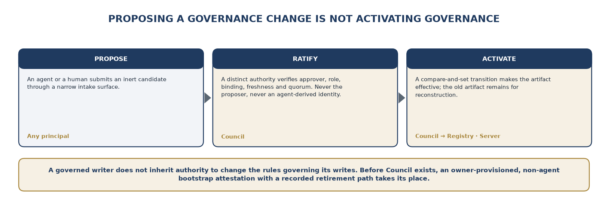

Governance changes follow candidate, tested, ratified, scheduled,
activated, and superseded states. The record links the old and new
artifact digests, proposer, approver, expected current activation,
affected deployment, and reason. Shadow evaluation compares historical
decisions under the candidate, but it is an impact report rather than
proof that all future behavior is safe.

A principal cannot ratify a governance proposal that policy identifies
as its own, and an agent-derived identity cannot become the ratifier
merely by delegating through another service. A deterministic pipeline
can supply approval only for change classes whose policy permits it and
only if the pipeline's own active controls are outside the proposing
agent's write authority.

## 10.3 Bootstrap without circular dependencies

The source plan requires a Council attestation for Server governance
transitions while Council itself depends on the foundation. The founder
will break that implementation cycle with an explicit bootstrap
contract. Before Council exists, Server's new governance boundary will
accept only a narrowly defined attestation from an owner-provisioned,
non-agent authority key. The attestation binds the intended transition
and expected prior state.

That temporary path will not be an undocumented bypass. Its identity,
permitted transition classes, expiry or retirement condition, and audit
record will be part of the installation. Once Council is qualified, a
recorded trust transition retires or restricts the bootstrap key. The
agent never receives either authority.

This is a revision decision, not a claim that Server 1.3.0 already
supports the contract. It allows the authority-role split to be
delivered before the entire platform while preserving the central
separation requirement.

## 10.4 Exceptions and practical limits

Break-glass will be a pre-authorized human procedure with narrow scope,
a short validity window, immediate recording, and post-event review. It
will not authorize an agent to suspend its own governance. Emergency
rollback can restore a prior approved artifact through an explicit
transition without requiring the system to erase its history.

The founder cannot provide a genuinely independent two-human approval
inside a one-person organization. Where a release or deployment requires
such a quorum, an external reviewer or customer authority must
participate. Until then, the corresponding claim remains unqualified.
The software will support multiple people; the founder's laboratory will
not pretend to contain them.

# 11. Munarium Harness: the easiest correct path

**Repository: iokaio/munarium-harness** (public skeleton: "SDKs that
make the governed path easy for honest agents"). Harness provides client
bindings, examples, and framework adapters. Its purpose is adoption and
consistency. It does not create a security boundary inside the agent
that uses it. Gate, Server, Warden, and Council must verify requests
even when Harness is bypassed, modified, or absent. [1]

## 11.1 Initial client surface

The first client will build a typed Action Proposal, carry task and
evidence references, receive a typed outcome, and expose decision
explanations. It will distinguish denied, approval-required,
accepted-for-execution, completed, failed-before-dispatch, and
unresolved outcomes. A generic exception must not encourage an agent to
repeat an action that may already have occurred.

Evidence references will be convenient to carry through the client, but
the client will not claim to prove the model's full information lineage.
A model can combine uncited information with cited material. For
authority-bearing fields, Gate or its connector must validate the value
against an authoritative source or require an explicit, separately
approved verification step.

Rust contract fixtures and one practical application client will precede
a broad language matrix. Python and .NET are initial candidates because
they support useful reference applications; TypeScript, Java, and
additional framework adapters follow demand and conformance evidence.
The plan's commitment is shared semantics across languages, not
simultaneous first releases of every binding.

## 11.2 Framework and protocol adapters

LangGraph, Semantic Kernel, the OpenAI and Claude agent SDKs, Google
ADK, MCP clients, and custom applications remain integration targets
from the source architecture. The revised solo plan treats each adapter
as a separately qualified surface, not a claim of current support.
Framework callbacks and convenience hooks do not substitute for
deployment-level credential and egress controls.

The native Action API remains canonical. An MCP client should see a
narrow tool surface synthesized from approved manifests. An adapter that
cannot represent a required obligation or preserve a request binding
must reject the operation or restrict its supported scope, rather than
silently degrading the contract.

## 11.3 Developer experience

Harness will include local examples, test fixtures, and diagnostics that
explain why a proposal was refused without disclosing another tenant's
policy or sensitive evidence. The initial commands and samples will
cover a fake ticket, a harmless approved effect, a blocked governance
mutation, and an ambiguous target response.

The founder will measure time to the first governed action and time to
diagnose the first denial. A sample that requires undocumented manual
changes has not passed the adoption gate. The examples will also show
what is not covered, including unmanaged model endpoints or tools
outside the mediated deployment.

Cross-language conformance will compare canonical request bytes, hashes,
error codes, and outcome handling. The most important test is not
whether each client can call an endpoint. It is whether two clients mean
the same thing when they submit or recover the same action.

# 12. Munarium Gateway: the model path and its budget

**Repository: iokaio/munarium-gateway** (public skeleton: "Model-call
mediation: routing, BYOK, budgets, screening"). Gateway mediates model
invocations, provider selection, data-release policy, and cost
admission. The supplied source describes a provider gateway already
embedded in Server and proposes extracting it for use by other agent
runtimes. The founder will preserve one implementation lineage rather
than maintaining incompatible accounting engines. [1]

## 12.1 Extraction before expansion

The first task is to identify reusable Server code and its actual tests,
then factor a versioned library or service boundary without changing the
existing Server behavior unexpectedly. The source distinguishes monetary
accounting from monetary admission caps; the standalone plan adds the
latter as new work, not as an already delivered capability.

The first reference release will qualify one hosted-provider route and
one local-inference route. Broader support for Azure-hosted models,
Bedrock, Vertex AI, NVIDIA endpoints, vLLM, Ollama, and other providers
will follow the same adapter contract. Provider names in the
architecture are targets, not a compatibility certification.

## 12.2 Budget admission and settlement

A model invocation will reserve an allowed amount of capacity before
dispatch. The accounting identity includes tenant, agent release, task,
and delegated work. Settlement records observed usage, price
assumptions, provider response metadata, and corrections. Child tasks
cannot spend outside the root task's approved ceiling by creating new
identifiers.

Unknown pricing or incomplete usage reports require a conservative
policy. A reservation may be based on a configured maximum, and a
provider response may later reconcile the estimate. The plan will state
where a monetary bound is exact, where it is conservative, and where
only token limits are enforced. A nominal dollar cap must not imply an
enforceable ceiling that the provider interface cannot support.

If required admission evidence cannot be durably recorded, Gateway will
not dispatch the call. Cancellation and timeout must account for the
possibility that the provider still completed billable work. Streaming
responses and tool-call outputs will carry invocation identifiers so
that partial results and later reconciliation can be linked.

## 12.3 Data and endpoint controls

The model path is also a data-disclosure path. Endpoint allowlists,
tenant boundaries, data classifications, retention preferences, and
approved processing locations must be checked before a prompt is sent. A
local retrieval index does not make a subsequent hosted-model request
local. The reference documentation will identify exactly which data
leaves the deployment.

Prompt-injection or content-safety classifiers can provide signals that
trigger review or additional restrictions. Their absence or agreement
cannot manufacture authority. Deterministic metadata, such as an
approved endpoint or a verified sensitivity label, will be distinguished
from probabilistic detection results.

Gateway will avoid retaining raw prompt content by default in public
diagnostics. Invocation hashes, policy decisions, usage records, and
evidence references can support accountability without turning the
ledger into an unnecessary archive of private material.

## 12.4 First release evidence

Tests will cover concurrent budget reservations, nested task spending,
price-version changes, cancellation, timeout, provider failure, wrong
endpoint selection, and redaction. Performance reporting will separate
provider latency from Gateway overhead. The founder will not duplicate a
provider's full API surface until an actual use case requires it.

# 13. Munarium Sentinel: operational evidence and bounded response

**Repository: iokaio/munarium-sentinel** (public skeleton: "Telemetry,
anomaly detection, circuit breakers, incident replay"). Sentinel
provides runtime observation and incident reconstruction from the
platform's records. It can request a pre-authorized suspension through
Warden. It cannot rewrite the policy it monitors or grant an agent
additional capability.

## 13.1 Useful before sophisticated detection

The first release will show a task's sequence of proposals, decisions,
approvals, claims, dispatches, receipts, and unresolved outcomes. It
will identify the exact evidence and policy versions observed at each
decision. That is a record of the system's inputs and actions, not
access to the model's internal beliefs.

Basic counters will include denial and escalation rates, grant issuance
and rejection, action frequency, missing receipts, budget saturation,
dependency health, and connector drift. A simple alert on an impossible
state transition is more valuable initially than a complex anomaly model
without a reliable underlying event contract.

OpenTelemetry export will use an explicitly pinned convention version.
Generative-AI conventions evolve, so export compatibility will be
versioned rather than assumed. Sensitive payloads will be excluded or
redacted according to the deployment policy. [11]

## 13.2 Circuit breakers

A breaker request must identify the caller, scope, reason, triggering
evidence, and requested duration. Warden authenticates and enforces the
suspension according to a previously approved policy. Sentinel may be
permitted to narrow capability automatically; it may not restore broader
authority simply because an anomaly score falls.

Restoration after a serious suspension will follow the applicable human
or deterministic approval path. An external SIEM or SOAR may submit the
same bounded request. Neither a SIEM alert nor a telemetry connector
becomes a general governance administrator.

The initial implementation will test the measured time from an
authenticated suspension request to rejection of new affected grants. It
will also show what happens to already dispatched work and to unconsumed
grants. A dashboard that displays suspended while the action path still
accepts work has failed its most important contract.

## 13.3 Blind spots and rebuildable views

Sentinel can maintain indexes and materialized views for performance,
but their records must retain source identifiers and watermarks. They
can be rebuilt from the authoritative ledger and declared event sources.
A missing interval must be visible, not silently filled with an
assumption that nothing happened.

Local enforcement does not depend on Sentinel being available. Gate's
authorization and Gateway's hard budget checks must continue to enforce
their approved boundaries without a functioning dashboard. If a
particular action explicitly requires current monitoring, that
dependency becomes an admission obligation and fails closed.

The name Munarium Sentinel refers to this software assurance component.
It does not imply equivalence to Kistner's separately described
hardware-isolated External Sentinel, whose scope is addressed in
Appendix A.

# 14. Munarium Assure: evidence that can be checked elsewhere

**Repository: iokaio/munarium-assure** (public skeleton:
"Control-framework mapping and evidence packs"). Assure will be open
source from the outset, replacing the source paper's enterprise-only
packaging candidate. Its initial value is a portable evidence package
and a verifier, not a claim of automated compliance.

## 14.1 Evidence-package contract

A package will identify the deployment boundary, component composition,
time interval, ledger ranges or pins, policy activations, system
inventory, approvals, exceptions, incidents, unresolved outcomes, and
declared omissions. Each item will retain a digest and a link to the
authoritative record or preserved artifact needed to verify it.

A verifier will check the package manifest, signatures, links, expected
ranges, and referenced artifacts without needing access to the running
Console. An authenticated package with a missing receipt must report the
gap. Integrity verification cannot transform incomplete evidence into
proof of completeness.

The first release will support a compact, machine-readable format and a
human-readable report. A broad collection of branded GRC exports is
secondary. The founder will first make the same package understandable
to an engineer investigating a failure and an assessor reviewing a
control claim.

## 14.2 Framework mappings

The source's NIST AI RMF, ISO/IEC 42001, zero-trust, OWASP, and EU AI
Act mappings remain useful organizing references. Assure will map
control objectives to evidence types and state the limits of the
mapping. An approval record can evidence that a named process step
occurred; it cannot prove the approver exercised good judgment or that
the application's business decision was correct. [1, 12, 13, 14]

Mappings will be versioned, attributed, and reviewed for applicable
rights. The project will not copy restricted standards text into an
open-source repository merely because the implementation is open.
Regulatory applicability, organizational role, and legal interpretation
remain the adopter's responsibility.

## 14.3 Retention and archival

Assure will support exports to an ordinary local archive first, with
object-lock or WORM targets added through adapters. The archive must
preserve the link structure and identifiers needed for later
verification. An external checkpoint or anchor can strengthen tamper
evidence, but it does not prove that the original events were true or
that omitted events never occurred.

Retention requires a separation between durable accountability metadata
and sensitive payloads. Tenant policy will identify what can be deleted
or cryptographically retired, what must be retained, and how a lawful
removal is represented without fabricating a complete replay afterward.
A historical policy decision can remain attributable even when a
protected source document is no longer retained; the report must
distinguish those levels of reconstructability.

## 14.4 Qualification

The release gate includes corrupted archives, missing artifacts, altered
manifests, unknown signing keys, revoked keys, withheld ranges, and
expired retention windows. Independent verification is meaningful only
when an adopter can run it without trusting the same UI that produced
the report.

Assure produces evidence for oversight. It does not certify an
enterprise, guarantee regulatory compliance, or validate model accuracy.
Keeping those boundaries explicit is part of the product, not a
disclaimer added after the sales material.

# 15. Munarium Console: one interface, no hidden privilege

**Repository: iokaio/munarium-console** (public skeleton: "One interface
for approvers, operators, and auditors"). Console is the human-facing
view of the platform. The founder will keep its first release small:
inventory, decision explanations, pending approvals, unresolved actions,
and operational status. Visual polish must not outrun the APIs that
enforce its behavior.

## 15.1 Read first, then governed interaction

The first public increment can be read-only. An operator should be able
to identify an agent owner, inspect a manifest, understand a denial, and
trace an action without editing effective policy. An approver view will
arrive when Council's binding and authentication contracts are ready.

Every consequential Console action will call a public, governed service
API. Approval goes to Council; suspension goes to Warden; a policy edit
creates a candidate through the permitted intake path. Console will have
no direct table-write connection to bypass those services.

Human authentication will use an established identity provider through a
supported federation method. A deployment may begin with a local test
IdP, but production documentation must not treat a demo identity
configuration as enterprise qualification. Session protection, CSRF
defenses, role boundaries, audit attribution, and secret handling are
part of the release scope.

## 15.2 The approval experience

An approval view will show the exact proposed effect, target, request
digest, evidence, obligations, expiry, and relevant prior state. The
user must be able to distinguish a new approval from a stale request
that no longer matches the target or policy. A changed request should
create a new review rather than silently updating the details behind an
old approval button.

The interface will distinguish proposed, authorized, dispatched,
completed, and unresolved. It will not render every non-error response
as success. An unresolved payment, deployment, or message is an
investigation item, not an invitation to press retry.

Console should reduce approval fatigue by showing the decision that
requires human judgment and the specific obligation to satisfy. A bulk
approval feature, if later added, must bind an explicit set of request
hashes and retain the same role and evidence requirements as individual
approvals.

## 15.3 Solo scope and accessibility

The founder will build one reusable web interface rather than separate
consoles for every role. It will support keyboard operation, readable
contrast, useful empty states, and exportable diagnostic references. A
command-line alternative remains important for headless and restricted
deployments.

The first release will not attempt a general workflow designer,
arbitrary dashboard builder, or proprietary administration tier.
Schema-generated forms can reduce implementation effort, but they must
not allow fields that the underlying contract excludes. Front-end
validation improves usability; server-side enforcement remains
authoritative.

Qualification includes role-confusion tests, approval substitution,
stale state, tenant isolation, session expiry, and confirmation of the
absence of Console-only administrative powers. A beautiful interface
cannot compensate for a weak authority model, and an accurate interface
must reveal the system's uncertainty rather than conceal it.

# 16. The foundation: Server and Matrix extensions

## 16.1 A versioned baseline, not an assumed finished substrate

The supplied v3 paper describes Server 1.3.0 as providing append-only
claims, disputes, historical reads, capability tokens, governance
profiles, guarded commands, and provider-call accounting. It describes
Matrix 1.0.0 as a governed read path with verified query contracts,
sealed evidence, authorization classes, and GitOps-managed assets.
The founder's plan reuses those foundations while requiring the
implementation baseline to be confirmed by a pinned revision and
repeatable tests. [1]

The source also identifies limitations that matter to the platform:
governance transitions were not yet separated into a distinct governance
role; guarded commands covered a bounded, opt-in path; interaction
capture could be best-effort; platform-wide federation and key discovery
were not equivalent to Server's existing token model; direct gRPC TLS
and native telemetry required work. These are reported source-baseline
findings. This revision does not assert that every current branch still
has the same behavior.

The founder will begin with a foundation qualification record. It will
identify the actual Server and Matrix revisions, tests executed, gaps
confirmed, and changes already completed. The roadmap can then reference
verified work rather than repeatedly treating a September version
description as current implementation evidence.

## 16.2 The nine Server changes

```text
  -----------------------------------------------------------------------
  ID     Required change                            Solo delivery
                                                    approach and
                                                    acceptance gate
  ------ ------------------------------------------ ---------------------
  S1     Separate governance authority from         Deliver first. Add a
         ordinary read-write and management roles.  transition
                                                    authorization
                                                    contract and a
                                                    non-agent bootstrap
                                                    attestation path. An
                                                    ordinary governed
                                                    writer cannot
                                                    activate a profile.

  S2     Add linked action-record shapes.           Define proposal,
                                                    decision, approval,
                                                    claim, grant,
                                                    dispatch, receipt,
                                                    compensation, and
                                                    activation events in
                                                    the hub. Required
                                                    records use the
                                                    durable path, not
                                                    best-effort
                                                    interaction capture.

  S3     Record verified principal chains.          Preserve user or
                                                    service origin, agent
                                                    release, instance,
                                                    and delegation.
                                                    Reject
                                                    unauthenticated
                                                    identity assertions.

  S4     Add source trust metadata and lineage      Start with verified
         queries.                                   source references and
                                                    derivation edges.
                                                    Unknown or incomplete
                                                    lineage remains
                                                    explicit. Later
                                                    extraction cannot
                                                    silently promote
                                                    trust.

  S5     Sign ledger checkpoints and support        Start with verifiable
         external witnesses.                        signed ranges and
                                                    export. Document who
                                                    controls the signing
                                                    key and what
                                                    tampering before or
                                                    after a checkpoint
                                                    can still evade
                                                    detection.

  S6     Export structured operational telemetry.   Pin the event and
                                                    telemetry schema.
                                                    Keep loss-tolerant
                                                    metrics separate from
                                                    mandatory action
                                                    facts.

  S7     Authenticate service-to-service channels.  Qualify one mTLS
                                                    deployment, including
                                                    any proxy termination
                                                    and authenticated
                                                    downstream hop.
                                                    Direct listener
                                                    support is not the
                                                    only possible
                                                    deployment, but every
                                                    hop must be explicit.

  S8     Extract shared model-gateway capabilities. Preserve Server
                                                    compatibility and one
                                                    accounting lineage.
                                                    Add new
                                                    budget-admission
                                                    behavior as a
                                                    separately tested
                                                    feature.

  S9     Factor guarded execution semantics into a  Avoid
         reusable owner-maintained library.         copy-and-diverge
                                                    implementations. Test
                                                    crash points, replay,
                                                    conflicts, and
                                                    unresolved outcomes
                                                    against the shared
                                                    protocol.
  -----------------------------------------------------------------------
```

S1 must not wait for all of Council. S2 must not wait for a reporting
interface. S3 and the canonical action contract must be stable enough
for Gate and Warden to agree before real target effects are enabled. The
staged plan therefore prioritizes authority, durable evidence, and
shared identity ahead of broad feature count.

## 16.3 Ledger scale, privacy, and historical meaning

An action platform can generate many more events than a memory
assistant. The founder will measure the size and write cost of complete
action chains, indexes, retention, and checkpointing. A high-volume read
may have a policy-approved summary record, but the system must not claim
a complete per-request history when only aggregates were retained.
High-consequence actions require individually attributable records.

The source's single-pin concept is retained for one Server cell and its
supported historical scope. A decision that also relies on an external
entitlement service, a target record version, and a regional ledger
requires a composite snapshot manifest. One integer must not imply a
globally atomic snapshot across systems that do not share a transaction
boundary.

Corrections remain new records. Derived indexes and lineage caches must
identify the evidence revision, ledger pin, authorization context, and
trust-label version they used. An immutable source fact may still become
inaccessible to a principal or be disallowed for a new action after its
authority or freshness changes. Historical replay and current permission
are separate questions.

Privacy and retention are not solved by append-only storage. The design
will keep secrets out of action facts, minimize sensitive payloads, and
use references to controlled artifacts where possible. Where evidence is
removed under an approved retention process, the remaining record must
state the loss of reconstructability rather than continuing to advertise
a complete replay.

## 16.4 Matrix remains read-only

Matrix's reviewed queries and typed evidence provide an important
precedent for Gate's narrow tools. The source describes pre-declared
SQL, bounded parameters, schema fingerprints, result schemas, denied
columns, and rejection of broad or unsupported query forms. The platform
will preserve that governed-read posture rather than adding target
writes for convenience. [1]

Matrix will register its approved query capabilities with Registry,
accept the platform's verified identity context, and assemble evidence
packets for Council. The effect classification will account for
sensitive disclosure, cost, and output destination. A read-only database
operation can still produce a high-consequence export; the label C0 is
not assigned solely because the statement is SELECT.

Existing Matrix Enterprise adapters stay with their current owner and
repository structure unless a separate migration is justified. The five
out-of-tree analytics adapters (Databricks, BigQuery, Snowflake, Cube,
and dbt) remain in the private repository.
Before moving any of them into the public platform structure, the
founder will review ownership, license terms, tests, and source
compatibility. The all-open direction does not erase third-party
obligations.

## 16.5 One Matrix product in munarium-matrix

Matrix is currently split across three places. The service and its
contract live in matrix/ inside iokaio/munarium. Its .NET, Java, and
Python client libraries live beside the Server clients in that
repository's clients/ tree. An older standalone export, with its own
community files, deployment scripts, and 1.0.0 clients, sits uncommitted
in a local checkout of the empty iokaio/munarium-matrix repository.
Each copy calls itself Matrix 1.0.0, but they differ in more than a
hundred files.

The founder will consolidate these into one product: one public
repository, one Cargo workspace, one set of client libraries, one CI
definition, one changelog, and one release tag. The monorepo's matrix/
and clients/matrix-* trees are the base because they carry every change
since the 1.0.0 release. The standalone export contributes only what it
adds and what survives review. Content that serves the proprietary
analytics adapters moves to the private repository and stays out of the
public repository.

The work has two phases, and their order is fixed. Phase 1 moves the
service, contract, and client libraries into iokaio/munarium-matrix
without changing any version: the service stays at 1.0.0 and the
clients at 1.1.1. When the move passes its gate, iokaio/munarium removes
its Matrix trees and points to the new repository. Only then does Phase
2 begin. It sets the service and all three client libraries to 1.2.0
and publishes Munarium Matrix 1.2.0 from munarium-matrix as its first
release there.

The service skips 1.1 because the clients are already at 1.1.1, and a
shared version must not go backward. The release keeps the 1.0 wire
contract, asset grammar, refusal registry, and adapter interface. The
minor version records the new source of record, the unified
versioning, and the changes accumulated since 1.0.0, not a contract
change. Server continues to vendor the Matrix contract bundle, pinned
to a munarium-matrix revision during the move and to the 1.2.0 release
afterward, rather than to a sibling directory. Appendix I gives the
inventory, steps, and acceptance evidence.

# 17. The governed action lifecycle

## 17.1 One request, several distinct decisions

A governed action begins with a proposal, not a credential. Gate
authenticates and normalizes it, resolves the manifest, gathers pinned
context, and evaluates policy. Council supplies additional approval
where required. Gate records a durable claim, Warden grants narrowly
scoped execution authority, and an isolated connector performs the
target call. Each step records its authoritative transition when it
occurs, not only after the entire workflow succeeds.

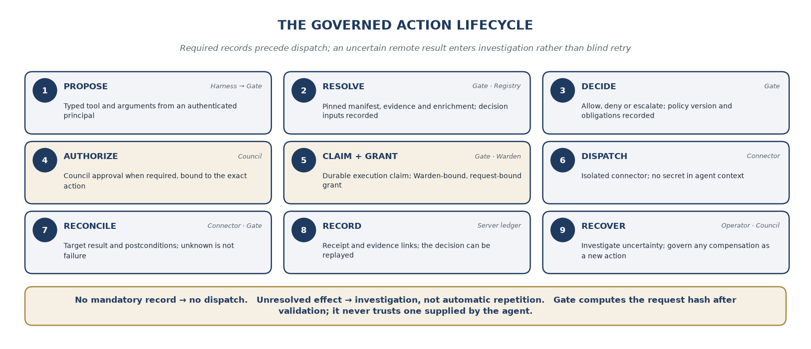

Figure 5. Required records precede dispatch. An uncertain remote result
enters investigation rather than blind retry.

The source diagram ends with a record stage. The founder's
implementation clarification is that mandatory evidence is not deferred
until the end. A proposal and decision are recorded before
effect-producing work; the claim and grant precede dispatch; the outcome
is appended when known. A failure between stages leaves a truthful
partial chain and a recoverable state.

## 17.2 The proposal contract

```text
  -----------------------------------------------------------------------
  Field group            Required meaning
  ---------------------- ------------------------------------------------
  Identity               Tenant, verified subject or service origin,
                         agent release, instance, and delegation
                         reference derived from authenticated context

  Capability             Tool identifier, manifest digest, explicit
                         target, and environment

  Arguments              Typed values with unambiguous defaults, bounded
                         sizes, and a canonical representation

  Evidence               Source references, evidence revisions, trust
                         metadata, and any required authoritative field
                         bindings

  Purpose                Task and session identifiers plus explanatory
                         intent; free text is not independent permission

  Execution identity     Stable business-operation identity and
                         idempotency key, with a rule distinguishing a
                         retry from a new intended action

  Preconditions          Target version or state expectation, validity
                         window, and required policy and evidence
                         freshness
  -----------------------------------------------------------------------
```

The agent may supply candidate values and evidence pointers. Gate
computes the authoritative request hash after validation. It does not
trust a hash supplied by the agent. Large payloads and attachments are
represented by verified content digests and controlled references, not
by a mutable URL that can serve different content after approval.

## 17.3 Hashes, freshness, and changing reality

The canonicalization specification will define included fields,
ordering, encoding, treatment of defaults, number representation, and
rejected ambiguous forms. Monetary values will use a contract that
avoids floating-point interpretation differences. Cross-language golden
vectors will show the exact bytes and digest expected for accepted and
rejected inputs.

The request hash binds what was proposed. The decision also binds the
policy digest, evaluator version, manifest, input snapshot, consequence
derivation, and obligations. Approval binds that decision context and
its permitted execution window. A grant binds the durable claim and
exact approved execution scope.

Hash binding does not freeze the world. Before dispatch, Gate must
recheck expiry, revocation, relevant policy activation, and target-state
preconditions. An approved vendor record update should fail or return
for new approval when the target's version has changed. A deployment
approved before a new freeze may no longer be eligible to execute. These
are freshness decisions, not evidence that hashing failed.

## 17.4 The execution state machine

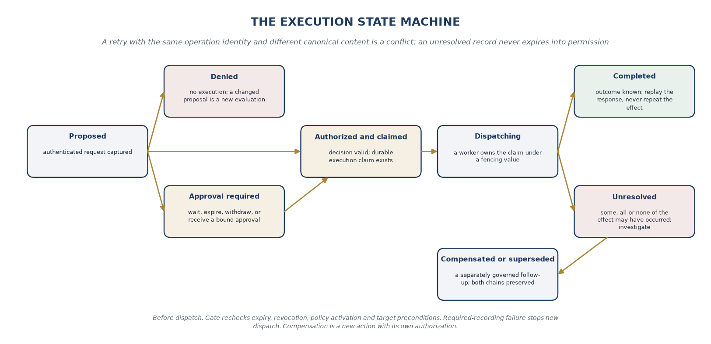

```text
  ------------------------------------------------------------------------
  State            Meaning                      Permitted next behavior
  ---------------- ---------------------------- --------------------------
  Proposed         Authenticated request        Validate, enrich, decide,
                   captured                     or reject

  Denied           Required authority or        No execution; a changed
                   condition absent             proposal is a new
                                                evaluation

  Approval         A specific obligation or     Wait, expire, withdraw, or
  required         distinct authority is        receive a bound approval
                   missing

  Authorized and   Decision is valid and        Request a grant after
  claimed          durable execution claim      required final checks
                   exists

  Dispatching      A worker owns the claim and  Record completed,
                   is attempting the target     failed-before-effect, or
                   call                         unresolved outcome

  Completed        Target outcome is known      Replay the recorded
                   within the connector         response; do not repeat
                   contract                     the effect

  Unresolved       Some, all, or none of the    Investigate and reconcile;
                   intended effect may have     no blind redispatch
                   occurred

  Compensated or   A separately governed        Preserve both chains and
  superseded       follow-up changed the        the reason for the
                   business outcome             follow-up
  ------------------------------------------------------------------------
```

A retry with the same operation identity and different canonical content
is a conflict. A legitimate second payment, ticket, or deployment is not
incorrectly suppressed merely because its arguments resemble an earlier
one. The operation identity must therefore come from application
semantics and persisted state, not from an agent inventing a new random
key on every retry or reusing a date-derived key for unrelated
operations.

## 17.5 Recovery and compensation

When a target supports reliable idempotent lookup, the connector can use
that capability to investigate an unknown outcome without creating
another effect. Otherwise a named operator procedure determines what
evidence is needed. An unresolved record does not expire into permission
to try again.

A compensation is a new action with its own authorization and record.
Reversing a transaction can itself be consequential, and not every
effect is reversible. An email may be impossible to recall; a database
migration may need a forward repair rather than rollback. The manifest
must describe the actual compensation semantics rather than claim
universal reversibility.

Required-recording failure stops new dispatch. If an outcome becomes
known while the central ledger is unavailable, the qualified connector
or execution journal must preserve it through the supported durable
recovery path. It must not invent a successful ledger write. The
resulting deployment tests must establish how that partial state is
recovered and how duplication is prevented.

# 18. Consequence classes and provenance-aware policy

## 18.1 A shared vocabulary with explicit scope

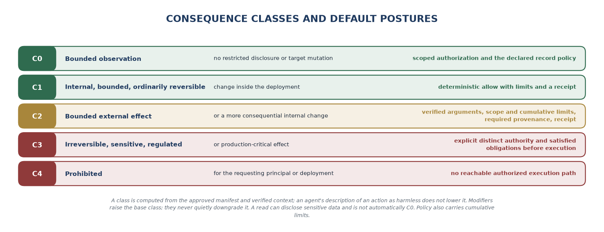

The founder retains the source's C0 through C4 vocabulary because it
allows architects and business owners to discuss the same control
decision. A class is computed from the approved manifest and verified
context. An agent's description of an action as harmless does not lower
its class. [1]

```text
  ------------------------------------------------------------------------
  Class            Typical meaning within the   Default posture
                   qualified deployment
  ---------------- ---------------------------- --------------------------
  C0               Bounded observation with no  Scoped authorization and
                   restricted disclosure or     the declared record policy
                   target mutation

  C1               Internal, bounded,           Deterministic allow with
                   ordinarily reversible change limits and a receipt

  C2               Bounded external effect or   Verified arguments, scope
                   more consequential internal  and cumulative limits,
                   change                       required provenance,
                                                receipt

  C3               Irreversible, highly         Explicit distinct
                   sensitive, regulated, or     authority and satisfied
                   production-critical effect   obligations before
                                                execution

  C4               Prohibited for the           No reachable authorized
                   requesting principal or      execution path
                   deployment
  ------------------------------------------------------------------------
```

Examples remain contextual. A draft can reveal confidential material. A
ticket can trigger downstream automation. A read can transmit protected
records to an external model. The connector's downstream effects and
destination matter as much as the immediate API operation. This is an
explicit refinement of the earlier paper's simplified examples.

Modifiers can raise the base class based on amount, recipient,
environment, evidence quality, data classification, or target state.
They cannot quietly downgrade it. Policy also needs cumulative limits: a
thousand individually small transfers or disclosures can exceed the
intended boundary even when each request fits a per-call limit.

## 18.2 Provenance is evidence, not a magic taint tracker

The source's important idea is that untrusted content must not become
authority merely by appearing in a model's context. The founder's
implementation will preserve source labels and derivation links through
ingested documents, extracted facts, and summaries. Missing or
unverifiable lineage remains unknown.

A model-provided citation cannot prove that a tool argument was derived
only from that source. For fields such as a bank account, recipient,
production target, or approved artifact, Gate should resolve the value
from an authoritative record or verify an exact field binding. A loosely
related citation is insufficient. Human verification can establish a new
authoritative record, but the original untrusted claim remains part of
the history.

Trust also has a scope. An internal directory may be authoritative for
employee identifiers without being authoritative for payment
destinations. Labels will therefore identify which claims or fields a
source can support, who assigned that authority, and how current it must
be. The plan rejects the assumption that an internal origin makes every
statement true or safe to act on.

## 18.3 Accounts-payable walkthrough

A prototype accounts-payable agent receives an invoice with new bank
details. It proposes a vendor-master update and a payment. The email is
retained as external evidence; its content supplies no authority to
alter the verified vendor record.

Gate resolves the vendor identifier against the existing master data,
identifies the new account as unverified, and blocks payment to that
destination. The update is routed to a specific verification obligation,
such as confirmation through a known contact channel already present in
the trusted vendor record. A number supplied in the suspicious email
cannot satisfy the callback requirement.

After an authorized person or approved business process records the
verified change, Council can approve the exact vendor update. Warden
brokers only the required connector capability. A later payment uses the
newly verified master record under its own decision and approval rules;
approval of the bank-detail update is not automatically approval of the
payment.

The example preserves the source's core story while making the
authority-bearing data path explicit. It is a projected use case, not an
implemented bank integration or a claim that every fraudulent
instruction will be detected.

## 18.4 Decision replay and policy testing

Policy tests will include expected allow, deny, and approval-required
outcomes; conflicting rules; missing inputs; stale context;
cumulative-limit exhaustion; and attempts to launder untrusted data
through derived memory. Test fixtures will retain their oracle and
approval history so that an agent cannot make a failing change pass by
silently rewriting the expected result.

Replay will use the same recorded inputs, policy bundle, engine version,
and contract semantics. Re-running a model with the same prompt is not
deterministic policy replay. Statistical evaluation of a changed model
is useful, but it is a separate activity with a separate claim.

# 19. Governance changes and the policy toolchain

## 19.1 The lifecycle of a rule

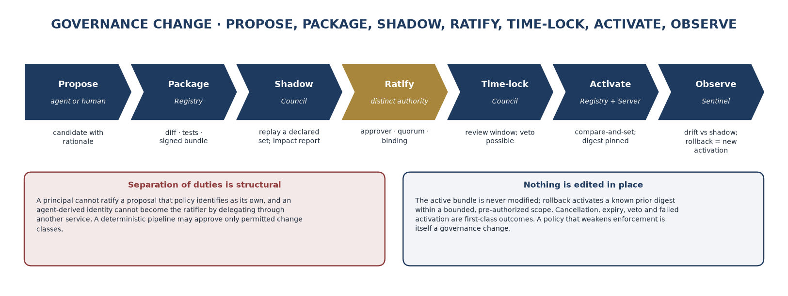

The source's propose, package, shadow, ratify, time-lock, activate, and
observe sequence remains the policy-change model. The founder will make
each state visible and versioned. The active bundle is never edited in
place; rollback creates a new activation of a known prior artifact.
[1]

A candidate change will include a human-readable rationale, affected
identities and tools, schema and compatibility information, regression
results, and the expected impact on denials and approvals. A generated
explanation is useful to the reviewer, but the machine-readable diff and
test evidence remain necessary.

Shadow evaluation replays a declared set of historical proposals and
reports changed decisions. It must identify what was excluded, whether
source evidence was available, and which inputs were reconstructed. A
successful shadow run does not prove correctness outside the evaluated
set. The founder will retain adversarial and boundary tests
independently of recent production traffic.

## 19.2 Promotion and rollback

Promotion will verify signer identity, expected current activation,
target environment, approval requirements, and the candidate digest. A
time-lock allows review for selected change classes. A policy that
weakens enforcement, widens a tool, changes an approver role, disables
required evidence, or changes an environment from enforce to observe is
itself a governance change.

Emergency rollback must be operationally useful without becoming a
general bypass. A pre-authorized rollback may permit restoration of a
specific previously approved digest within a bounded scope, with
immediate recording and later review. It must not allow an agent to
label an arbitrary new bundle a rollback.

Cancellation, expiry, veto, and failed activation are first-class
outcomes. A ratified artifact whose activation failed should not appear
as effective merely because the approval step succeeded. Registry and
Server activation must use supported compare-and-set or equivalent
version checks to avoid competing updates.

## 19.3 One policy language first

The source's policy-language question remains open until the first
implementation spike is complete. The founder's solo plan avoids two
primary evaluators in the first release. Existing enterprise policy
systems may supply verified inputs or sit behind a qualified adapter,
but their decisions must have an explicit role and failure contract.

Federated policy will initially favor separately evaluated mandatory
parent constraints and local restrictions with deny-overrides behavior.
This is easier to reason about than claiming that an arbitrary
policy-merging compiler can prove every child policy is stricter. More
advanced analysis can be added later with its actual supported language
subset and proof limits stated.

The toolchain will provide linting, schema checks, signed fixtures,
policy replay, and a concise impact report. The founder's goal is a
small workflow that can be repeatedly executed from source, not an
elaborate policy studio that becomes a second ungoverned control
surface.

# 20. Supporting systems without nine more services

The source identifies discovery, policy engineering, connector
qualification, DLP, evaluation, federation, archival, developer tooling,
and SRE as necessary supporting capabilities. The founder retains that
scope but assigns the work to existing repositories or hub recipes
rather than immediately creating another set of independently deployed
products. [1]

```text
  ------------------------------------------------------------------------
  Supporting       Initial owner                First useful scope
  capability
  ---------------- ---------------------------- --------------------------
  Discovery and    Registry, with hub import    Import declared agent and
  ownership        recipes                      tool metadata; distinguish
  reconciliation                                candidate, active,
                                                drifted, and unmanaged
                                                records

  Policy           Council plus hub contracts   Lint, test, shadow,
  engineering      and fixtures                 approve, activate, and
                                                rollback a signed bundle

  Connector        Gate                         Isolated execution, narrow
  runtime and                                   manifests, fault tests,
  qualification                                 versioned conformance
                                                results

  Data             Gate and Gateway             Consume verified labels;
  classification                                keep probabilistic signals
  and DLP adapters                              distinguishable from
                                                authority

  System           Hub integration tests, with  Versioned tasks spanning
  evaluation       Harness clients              retrieval, proposals,
                                                policy, outcomes, cost,
                                                and latency

  Federation       Council, Registry, Warden    Parent constraints, local
                                                authority, scoped
                                                cross-domain requests;
                                                initially a tested
                                                prototype

  Archive and      Assure and Server            Verifiable export, signed
  external witness                              checkpoints,
  support                                       retention-aware
                                                verification

  Developer CLI    Harness; composition recipes Local setup, explain,
  and scaffolding  in hub                       replay, and diagnostic
                                                export

  Platform         Each component, coordinated  Health checks, restore,
  operations       in hub                       key rotation, migration,
                                                and operational runbooks
  ------------------------------------------------------------------------
```

## 20.1 Discovery must not become automatic permission

The initial discovery path will accept machine-readable inventories from
a limited number of sources. It will not promise to find every agent or
credential in an enterprise. An observed endpoint can generate a
candidate record and an owner-assignment task, but it cannot
automatically become an approved tool.

A comparison between registered capabilities and observed activity will
identify drift and uncovered paths. The record must also identify
discovery blind spots. A count of zero unmanaged paths is meaningful
only within the declared inventory scope and observation period.

## 20.2 A connector qualification workflow

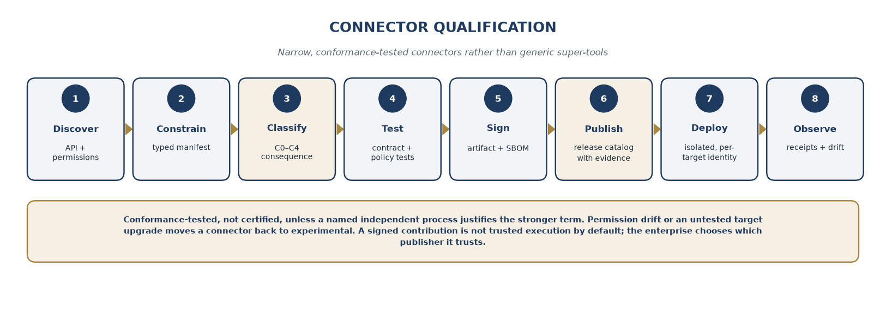

Connector work will proceed through discover, constrain, classify, test,
sign, publish, deploy, and observe. The source uses certification
terminology; the revised plan initially uses **conformance-tested**
unless a named independent process justifies a stronger term. Passing a
published suite is evidence about specific versions and conditions, not
a guarantee of safety forever.

The connector descriptor will state API version, scope, credential type,
tenant boundary, side effects, target preconditions, idempotency
behavior, timeout interpretation, rate limits, data handling, and
compensation. Permission drift or an untested target upgrade can move a
connector back into experimental status.

Contributors may add connectors, but a signed contribution is not
trusted execution by default. An enterprise chooses which publisher and
artifact it trusts. Gate still checks the approved manifest and
deployment policy, and the release catalog retains the exact evidence
supporting the connector's advertised level.

## 20.3 Evaluation and change safety

A release can change even when its policy code does not: a model,
prompt, retriever, source schema, connector, or identity configuration
may change the proposals presented to Gate. The integration suite will
therefore treat the application composition as the unit of evaluation.

The founder will retain representative successful tasks alongside
malicious documents, stale evidence, unauthorized requests, degraded
dependencies, and recovery cases. The tests will report answer quality
separately from authority enforcement. A correct answer does not
authorize an action, and a correctly denied action does not prove the
answer was accurate.

The core sample suite will run without paid cloud services wherever
possible. Provider-specific tests and enterprise sandboxes can be
separate, explicitly labeled jobs. That structure allows public
contributors to validate meaningful behavior without acquiring every
vendor subscription.

# 21. Adoption across different enterprise journeys and stacks

## 21.1 Maturity is not a prerequisite for participation

The founder's platform plan accommodates enterprises that are
experimenting with prompts, operating document assistants, allowing
agents to prepare changes, or already running bounded autonomous
workflows. The control boundary grows with consequence. A company does
not need a mature agent platform to benefit from governed memory or an
explicit model budget. [1]

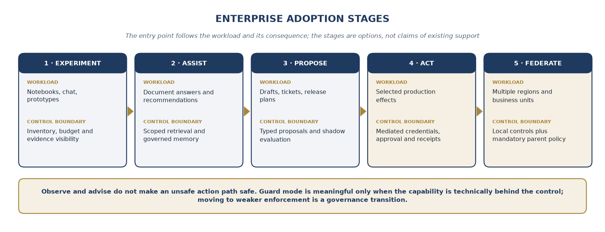

Figure 6. The entry point follows the enterprise's workload and
consequence. The stages are adoption options, not claims of existing
support.

The source's five adoption stages remain experiment, assist, propose,
act, and federate. The first two can produce value without giving an
agent external action authority. At propose, the platform captures and
evaluates requests while keeping execution elsewhere. Act requires the
complete authorized path for the chosen scope. Federate adds multiple
authority and data domains; it is not merely a larger dashboard.

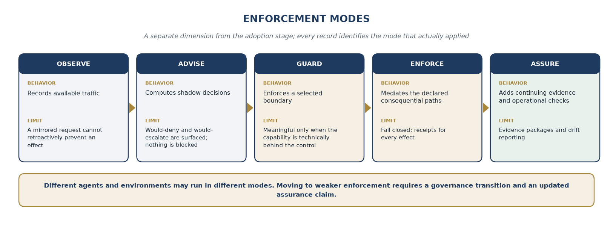

Enforcement mode is a separate dimension. Observe records available
traffic. Advise computes shadow decisions. Guard enforces a selected
boundary. Enforce mediates the declared consequential paths. Assure adds
continuing evidence and operational checks. An enterprise can use
different modes for different agents and environments, but every record
must identify the mode that actually applied.

Observe and advise do not make an unsafe action path safe. A mirrored
request cannot retroactively prevent an effect. Guard mode is meaningful
only when the selected capability is technically behind the control; a
toggle in a dashboard is not sufficient. Moving to weaker enforcement
requires a governance transition and an updated assurance claim.

## 21.2 Brownfield patterns

```text
  ------------------------------------------------------------------------
  Pattern          Use in the revised plan      Boundary that must remain
                                                visible
  ---------------- ---------------------------- --------------------------
  Front-door       Gate becomes the sole        Target credentials and
  mediation        approved path to a narrow    network access outside
                   API or tool.                 that path must be removed
                                                or explicitly excluded.

  Isolated adapter A legacy runtime's calls are The agent must not be able
  or sidecar       converted into Action        to bypass or reconfigure
                   Proposals outside its        the adapter.
                   process.

  Delegated        The agent submits a request; Workflow evidence and the
  enterprise       an approved worker executes  exact execution request
  workflow         after Council records        must remain bound.
                   authority.

  Observation      Metadata or traffic creates  The deployment is
  before migration an inventory and             non-enforcing and must not
                   shadow-policy baseline.      be described as governed
                                                execution.
  ------------------------------------------------------------------------
```

The founder will favor the smallest migration that removes a meaningful
unmanaged capability. A complete replacement of an enterprise's runtime
is not a prerequisite. A single production deployment action,
customer-message path, or vendor-update operation can establish a useful
boundary while other applications remain outside the pilot.

## 21.3 Multi-stack design, selective qualification

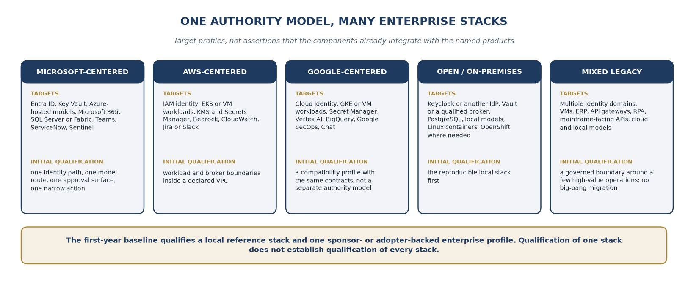

```text
  ----------------------------------------------------------------------------
  Enterprise profile   Representative integration   Initial qualification
                       targets                      approach
  -------------------- ---------------------------- --------------------------
  Microsoft-centered   Entra ID, Key Vault,         One identity path, one
                       Azure-hosted models,         model route, one approval
                       Microsoft 365, SQL Server or surface, and one narrow
                       Fabric, Teams, ServiceNow,   action; private deployment
                       Sentinel                     before broad ecosystem
                                                    claims

  AWS-centered         IAM-based identity, EKS or   Workload and broker
                       VM workloads, KMS and        boundaries inside a
                       Secrets Manager, Bedrock,    declared VPC;
                       enterprise data services,    target-specific grants and
                       CloudWatch, Jira or Slack    verified event export

  Google-centered      Cloud Identity, GKE or VM    A separate compatibility
                       workloads, Secret Manager,   profile using the same
                       Vertex AI, BigQuery, Google  contracts and evidence
                       SecOps, Chat                 shape, not a separate
                                                    authority model

  Open or on-premises  Keycloak or another IdP,     Reproducible local stack
                       Vault or a qualified secret  first; optional
                       broker, PostgreSQL, local    orchestration and offline
                       models, Linux containers,    artifacts as independently
                       OpenShift where needed       tested additions

  Mixed legacy         Multiple identity domains,   A governed request
                       VMs, ERP, API gateways, RPA, boundary around a few
                       mainframe-facing APIs, cloud high-value operations; no
                       and local models             big-bang credential
                                                    migration
  ----------------------------------------------------------------------------
```

These are target profiles, not assertions that the nine components
already integrate with the named products. The first-year baseline will
qualify a local reference stack and one sponsor- or adopter-backed
enterprise profile. Additional stacks can remain documented recipes or
experimental adapters until their evidence is available.

## 21.4 Integration priorities

```text
  ------------------------------------------------------------------------
  Priority         Integration family           Scope and ownership
  ---------------- ---------------------------- --------------------------
  P0               Identity, secrets, local     Warden and Server;
                   target, durable record       mandatory for the first
                                                effect-producing reference
                                                path

  P0               Action API, MCP, one         Gate and Harness;
                   application client           identical authorization
                                                semantics across supported
                                                transports

  P1               CI/CD and source-control     A narrow issue,
                   workflows                    pull-request, or
                                                release-request example;
                                                publication and production
                                                deployment remain
                                                separately authorized

  P1               One ITSM or approval         Council; exact request
                   integration                  binding, authenticated
                                                approval, expiry, and
                                                target-state checks

  P1               One hosted and one local     Gateway; endpoint policy,
                   model path                   data boundary, budget and
                                                invocation evidence

  P1               Telemetry and evidence       Sentinel and Assure;
                   export                       OpenTelemetry plus a
                                                portable evidence pack
                                                before many
                                                vendor-specific dashboards

  P2               Document and collaboration   SharePoint, OneDrive, file
                   systems                      stores, DMS platforms, and
                                                messaging as candidate
                                                sources or narrow actions;
                                                original ACLs and
                                                disclosure policy
                                                preserved

  P2               ERP, CRM, HR, and business   SAP, Dynamics, Salesforce,
                   APIs                         Workday, and internal
                                                services as adopter-driven
                                                targets; no generic
                                                transaction super-tool

  P2               Data and semantic platforms  Matrix adapters, including
                                                warehouse and
                                                semantic-layer targets
                                                from the source plan; read
                                                scope and evidence binding
                                                tested

  P3               PAM, GRC, cloud posture, and CyberArk-class brokers,
                   federation                   GRC exports, discovery
                                                feeds, and regional
                                                control domains when
                                                access and reviewers are
                                                available
  ------------------------------------------------------------------------
```

A priority is not a delivery promise. P2 and P3 work enters the
founder's queue only when it has a clear use case, a representative test
environment, rights to distribute the adapter, and a bounded acceptance
contract. An integration requiring months of inaccessible vendor
qualification should not block a useful open-source core.

# 22. Deployment, federation, and degraded operation

## 22.1 Three deployment profiles

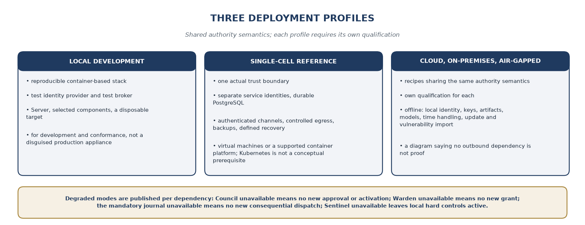

The local development profile will provide a reproducible
container-based stack with a test identity provider, test broker,
Server, selected components, and a disposable target. It is for
development and conformance, not a disguised production appliance.
Sample credentials must be generated or clearly confined to the
disposable environment.

The single-cell reference profile will establish one actual trust
boundary with separate service identities, durable PostgreSQL storage,
authenticated channels, controlled egress, backups, and a defined
recovery method. It can be operated on virtual machines or a supported
container platform. Kubernetes is not a conceptual prerequisite; the
chosen deployment must enforce the required isolation.

Cloud, on-premises, and air-gapped recipes will share authority
semantics but require their own qualification. An offline installation
needs local identity, keys, artifacts, model availability where
relevant, time handling, and a plan for importing updates and
vulnerability information. A design diagram saying no outbound
dependency is not proof that every package or optional integration
operates disconnected.

## 22.2 Degraded modes

```text
  -----------------------------------------------------------------------
  Dependency or failure  Required behavior in the first reference profile
  ---------------------- ------------------------------------------------
  Council unavailable    No new approval or governance activation.
                         Previously authorized work proceeds only if its
                         obligations, policy validity, expiry, and other
                         dependencies permit it.

  Warden unavailable     No new execution grant. Existing unconsumed
                         grants remain subject to the supported
                         validation and revocation contract.

  Server or mandatory    No new consequential dispatch requiring that
  journal unavailable    record. In-flight uncertainty is preserved and
                         recovered through the qualified journal path.

  Registry unavailable   Verified cached artifacts may be used only
                         within explicit freshness and revocation limits.
                         Otherwise the action is refused.

  Sentinel unavailable   Local hard authorization and budget controls
                         remain active. Monitoring gaps are visible;
                         actions requiring current monitoring stop.

  Connector timeout or   The claim moves to an investigated state when
  process loss           outcome is unknown. Another worker does not
                         blindly repeat the call.

  Clock or               Time-sensitive grants and approvals fail closed
  key-validation         rather than accepting an unverifiable validity
  uncertainty            window.

  Target schema or API   The affected connector version is quarantined or
  drift                  restricted until conformance is restored.
  -----------------------------------------------------------------------
```

This table refines the earlier paper's broad statement that an
unavailable authority plane stops all consequential work. The actual
decision depends on which authority is required at that point and which
approvals or signed artifacts remain valid. The system must publish that
dependency contract rather than alternate between incompatible outage
rules.

## 22.3 Federation as later open work

Federation retains the source's enterprise, region, business-unit,
application, and task levels. A local authority can add restrictions but
cannot remove a mandatory parent prohibition or widen a nondelegable
maximum. The first prototype will evaluate mandatory constraints
separately and require all applicable authorities to allow the action.

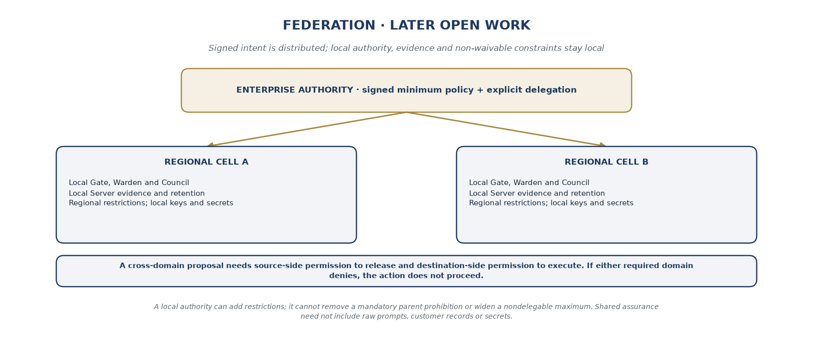

Figure 7. Later federation distributes signed intent while retaining
local authority, evidence, and non-waivable constraints.

Each domain may retain its own Server cell, keys, secrets, and evidence.
Central assurance can receive signed metadata and control results
without collecting raw customer documents. A cross-domain request needs
both source-side permission to release the data or effect and
destination-side permission to accept and execute it.

Approval cannot override a nonwaivable prohibition. If either required
domain denies, the action does not proceed. If an explicit exception
mechanism exists, it must name the authority that may grant the
exception and the rule it can change. A generic escalation is not
permission to ignore another domain's restriction.

A cross-domain evidence package will contain the relevant local pins and
policy digests. It will not advertise a single globally atomic ledger
position unless the implemented system actually supplies one. The
release will also define behavior when a remote domain is unavailable or
when its approval expires before the destination dispatches.

## 22.4 Recovery is part of the product

The first supported profile must demonstrate backup restoration, key
rotation, migration, stale-worker fencing, and upgrade rollback. Restore
testing must include action claims and revocation state, not just
application data. Restoring an old database must not reactivate a
consumed grant or make an unresolved action appear never attempted.

The founder will publish measured recovery objectives for the qualified
profile only after exercises establish them. Multi-region high
availability, specialized cryptographic validation, and broader air-gap
packaging remain open roadmap work whose maturity is separately
reported.

# 23. Six projected enterprise uses, beginning with a founder-scale proof

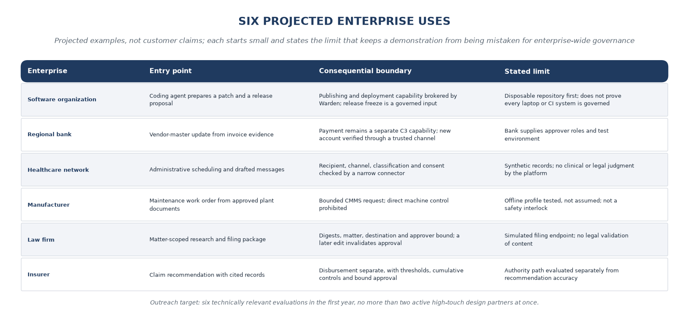

The following cases preserve the industries and architectural concerns
in the source paper. They are projected examples, not customer claims.
Each one identifies a small entry point, the consequential boundary,
evidence to collect, and a limit that prevents a demonstration from
being mistaken for enterprise-wide governance. [1]

## 23.1 Software organization: coding agents and controlled release

This is the founder's preferred first reference case because it is
closest to the work already occurring around VCP and Munarium. A coding
agent can inspect an authorized checkout, prepare a patch, run bounded
tests, and create a release proposal. It cannot publish packages,
replace protected release policy, or obtain production deployment
credentials from its workspace.

The proposed effect references an exact source revision, build artifact
digest, test evidence, target environment, and change window. Gate
evaluates it; Council verifies the required independent authority;
Warden grants only the bounded publishing or deployment capability. A
release freeze is a governed input, not a sentence in an agent prompt.

The first demonstration will use a disposable repository or test
deployment. It will attempt a normal release, a substituted artifact, a
changed target, a stale approval, and a direct credential bypass.
Acceptance means that the legitimate path works and the prohibited
variants fail within the declared environment. It does not prove that
every developer laptop or CI system in an enterprise is governed.

## 23.2 Regional bank: vendor maintenance before payment

A bank with an established approval process begins with a single
vendor-master workflow. The agent gathers invoice evidence and proposes
a change. It does not receive an ERP or payment credential. The new
account must be verified against an approved business process before
becoming an authoritative destination.

The pilot can start in advise mode to identify policy exceptions, then
move that one operation behind Gate and Warden. Payment release remains
a separate C3 capability and is not enabled merely because vendor
updates work. The bank supplies its approver roles and test environment;
the founder supplies the open implementation and the qualified boundary.

Evidence includes attempted unverified changes, bound approvals, target
record versions, actual receipts, and unresolved outcomes. The pilot
measures completion time and verification burden alongside policy
failures. A faster workflow is not accepted if the speed comes from
removing the verification step that gives it authority.

## 23.3 Healthcare network: administrative messaging and scheduling

The entry point is a document assistant that proposes administrative
scheduling changes and drafts messages. Patient and organizational scope
must remain attached to retrieval and to the eventual recipient.
Accurate content does not establish that it may be disclosed through a
given channel.

A narrow message connector checks the approved patient context,
recipient, channel, content classification, and any required consent or
organizational authorization record. The enterprise defines those rules.
The platform does not independently determine clinical appropriateness
or legal permission.

The first pilot uses synthetic records and test recipients. A restricted
export remains disabled or requires an explicitly qualified
high-consequence path. Evidence tests include cross-patient access, a
changed recipient after approval, stale authorization, and an
external-model route that would disclose data beyond the approved
boundary.

## 23.4 Manufacturer: maintenance requests without machine-control authority

Governed shift-handover memory is the starting point. The agent proposes
a maintenance work order based on approved plant documents and recorded
observations. Gate creates the bounded CMMS request after the applicable
checks. Direct machine-control changes remain prohibited in the initial
profile.

The plant may operate with unreliable connectivity, so the reference
design places the approved policy, identity validation, and evidence
record locally. The offline profile must be tested rather than assumed
from container deployment alone. A missing remote service cannot cause
the local connector to bypass required authority.

The pilot measures work-order quality, attribution, and recovery after a
communication failure. Safety-critical actuation would require separate
domain engineering and validation. The platform is not presented as a
replacement for certified machine-safety controls or the plant's
existing interlocks.

## 23.5 Law firm: matter-aware preparation and controlled submission

The first use is matter-scoped research and document preparation. Source
ACLs, matter identifiers, and permitted recipients constrain what the
agent can retrieve and what a proposed submission may contain. The agent
may prepare a filing package without having credentials to submit it.

A release request binds the final document digests, matter, destination,
and required approver. A later edit invalidates the old approval.
Privileged attachments cannot be sent to an address that exists only in
untrusted retrieved content. The firm supplies its review roles and
source-system rights.

The first evaluation stops at a simulated filing endpoint or a
firm-controlled test channel. It records whether an operator can
reconstruct the evidence and exact package approved. It does not imply
legal validation of the filing's content or automatic support for every
court system.

## 23.6 Insurer: recommendations before disbursement

The agent assembles a claim recommendation and cites the records that
support it. Gate checks the claimant, requested amount, source versions,
target, and applicable authority. Fraud indicators can trigger review,
but an advisory score cannot replace a required approval or authorize
payment.

A low-consequence internal status update may be the first enabled
effect. Disbursement remains a separate capability with explicit
thresholds, cumulative controls, and a bound approval. Changing the
claimant's payment details invalidates assumptions made by an earlier
decision.

The pilot reports accepted and denied requests, human verification time,
exceptions, and recovery behavior. It evaluates the authority path
separately from the substantive accuracy or fairness of the
recommendation. Those broader business and model-quality obligations
remain with the insurer's application governance.

## 23.7 The adoption target under a solo plan

The founder will seek six technically relevant enterprise evaluations
over the first year, with no more than two active, high-touch design
partners at once. That is an outreach and learning target. It does not
assume six production contracts, six founder-operated installations, or
six different stacks qualified simultaneously.

A useful design partner supplies an owner, a test environment, a narrow
workflow, a review cadence, and permission to share sanitized lessons.
An adopter that cannot provide those inputs may remain a self-service
evaluator. The sequence favors repeatable learning over a collection of
bespoke implementations that only the founder can maintain.

# 24. Threat model, verification, and release integrity

## 24.1 The threat assumptions

The platform assumes that an agent can be manipulated, its code can be
compromised, source content can be malicious, and operators can make
mistakes. It also treats the connector zone, build pipeline, policy
publisher, and founder-controlled administrative roots as important
attack surfaces. The claim is not that deterministic code is
automatically correct; it is that the intended control is implemented
outside the model and tested against a defined threat model.

```text
  ------------------------------------------------------------------------
  Threat           Primary control in the       Residual risk or
                   revised plan                 qualification limit
  ---------------- ---------------------------- --------------------------
  Prompt injection Narrow actions, verified     Permitted low-consequence
  and provenance   authority-bearing fields,    behavior and answer
  laundering       source lineage, explicit     quality may still be
                   approval                     affected.

  Excessive agency No ambient target            Uninventoried credentials
  or unmanaged     credentials, constrained     or host privileges remain
  path             tools, egress and            outside the tested
                   target-side restrictions     boundary.

  Approval         Canonical content binding,   Canonicalization defects,
  substitution or  expiry, policy epoch and     compromised signers, and
  stale state      target preconditions         stale authoritative inputs
                                                require testing.

  Grant replay or  Atomic grant consumption,    Remote effects can remain
  duplicate        durable claim, fencing,      ambiguous; exactly-once is
  dispatch         target idempotency where     not promised.
                   available

  Compromised      Per-target identity and      The connector is
  connector        network scope, secret        privileged and can have a
                   isolation, version           high-impact blast radius
                   qualification                within its granted scope.

  Self-changing    Inert proposals, separate    Founder or enterprise root
  governance       activation identity,         administrators remain
                   protected workflows and      trusted, and human
                   trust roots                  collusion is not
                                                eliminated.

  Approval fatigue Specific obligations,        The platform cannot
                   visible evidence, limited    guarantee the quality of
                   escalation and review        human judgment.
                   metrics

  Ledger or        Signed checkpoints, retained Signing-key compromise,
  evidence         links, independent verifier  false original inputs, and
  tampering        and optional witnesses       omitted events remain
                                                distinct risks.

  Runaway cost or  Root-task reservations,      Provider accounting
  cumulative       aggregate limits, bounded    limitations and already
  effects          delegation and suspension    dispatched work must be
                                                disclosed.

  Malicious build  Pinned dependencies,         Attestation does not prove
  or dependency    protected CI, provenance,    a compromised trusted
                   scans, isolated runners and  builder is honest.
                   review
  ------------------------------------------------------------------------
```

## 24.2 Invariants before integration breadth

The hub will maintain an invariant catalog with stable identifiers. Each
invariant names the claim, its trust assumptions, its owner, the tests
that exercise it, and the release evidence. Appendix C gives the
starting catalog.

Examples include absence of target credentials from the agent plane;
refusal of agent-originated governance activation; binding of approval
to the exact content and current preconditions; no grant without a
durable claim; no automatic repetition of an unresolved effect;
preservation of tenant boundaries; and rejection of a local policy that
removes a mandatory parent prohibition.

Tests will combine unit checks, property-based tests, fuzzing,
concurrency tests, protocol fixtures, failure injection, and adversarial
application scenarios. Independent security review will focus on the
actual qualified boundary. A review of Warden alone does not certify
Gate connectors, and a review of one deployment profile does not certify
all clouds.

## 24.3 Protecting the development control plane

Agent-generated pull requests must not execute with production secrets
or publication authority. Untrusted code must not run in a workflow
context that grants broad repository or cloud permissions. Protected
workflow changes require a separate review and activation path, and the
code under review cannot silently replace the checks used to approve it.

The founder will use distinct development, test, and release
credentials. The agent may prepare a release request, but the trusted
release process builds the approved revision and publishes only after
the required checks. Release signing material remains outside the
agent's accessible environment. Local administrative access is minimized
and documented rather than ignored.

AI-assisted contributions require a human submitter who accepts
responsibility for the change, identifies relevant borrowed material,
and provides executed test evidence. A model cannot hold maintainer
accountability or sign a contribution on behalf of an unknown person.
The repository's contribution process will make ownership and provenance
review part of acceptance.

## 24.4 Release labels with evidence

```text
  -----------------------------------------------------------------------
  Label                  Minimum meaning
  ---------------------- ------------------------------------------------
  Planned                Architecture or work items exist; no functioning
                         capability is claimed.

  Experimental           A runnable prototype exists with explicit
                         limitations and no broad production claim.

  Conformance-tested     A named version passes the published suite for a
                         stated environment and contract.

  Reference-qualified    The integrated composition passes operational,
                         recovery, authority, and deployment tests for a
                         specific profile.

  Independently reviewed A named independent review covers a stated
                         revision and scope; findings and residual
                         limitations are recorded appropriately.
  -----------------------------------------------------------------------
```

These are evidence labels, not paid editions. All associated Ioka-owned
implementation remains open source. A component may be
conformance-tested while another remains experimental; the platform
composition must not advertise a stronger boundary than its weakest
required dependency supports.

# 25. The founder-led roadmap

## 25.1 Calendar targets and capacity assumptions

The roadmap begins when the founder starts this revised program. It does
not insert the earlier six-month financing and recruiting lead time.
Every new component repository is intended to be public during the
opening stage, subject to the publication and ownership checks.
Functional releases then advance in dependency order.

The illustrative twelve-month target assumes roughly thirty focused
project hours per week across forty-four productive weeks, including
architecture, implementation oversight, verification, documentation,
maintenance, and adopter work. That is 1,320 founder hours, not 1,320
coding hours. It is a planning assumption, not a statement about his
current availability or an instruction to add those hours on top of
another full-time role.

Lower availability, unresolved foundation defects, unavailable
enterprise sandboxes, or security findings require rebaselining. Agent
throughput does not erase those constraints. The release gates are
commitments to evidence; the month ranges are targets that can change.

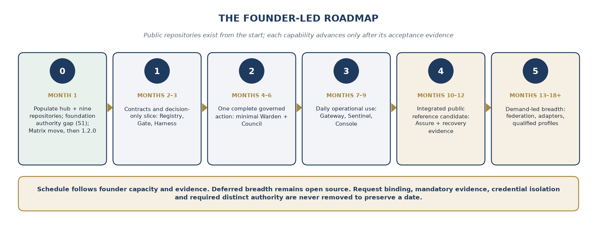

Figure 8. A proposed founder-capacity roadmap. Public repositories exist
from the start; each capability advances only after its acceptance
evidence.

## 25.2 Stage 0: public structure and foundation qualification

**Target window: month 1.** The munarium-platform hub and the nine
public component repositories were created on 28 September 2026, each
with an Apache-2.0 license and a one-line README. The founder moves
reviewed planning material from the private repository into the hub, records contribution conventions, publishes the
component-status table, and establishes the invariant catalog. Each
repository gets a real initial issue, a bounded scope statement, and a
test or acceptance specification rather than an empty promise.

The foundation qualification record pins Server and Matrix. S1 is the
first substantive product change: ordinary governed-write authority
cannot activate governance. The temporary non-agent attestation path
avoids waiting for Council while remaining explicit and auditable.

In the maintenance lane, the founder first moves Matrix and its client
libraries into iokaio/munarium-matrix at their current versions, and
only then releases the service and every client as Matrix 1.2.0
(section 16.5 and Appendix I). That work does not block Stage 1. Until
the move's cutover, the qualification record pins Matrix 1.0.0 in
iokaio/munarium. Between the cutover and the release, it pins the
recorded munarium-matrix revision. After the release, it pins the
v1.2.0 tag.

**Exit evidence:** public planning artifacts, verified repository
ownership, a secret and rights review, reproducible foundation tests,
and a demonstrated refusal of an unauthorized governance transition. A
failed publication review delays exposure of affected history, not the
availability of a clean public design. The Matrix move and the 1.2.0
release each have their own gate in Appendix I.6.

## 25.3 Stage 1: contracts and decision-only capability

**Target window: months 2--3.** Registry's catalog, Gate's evaluator,
the action-record shapes, verified principal context, and a minimal
Harness client form the first usable increment. The reference target is
disposable. The platform can explain and replay a decision without
claiming it can yet govern enterprise effects.

The founder resolves the initial policy-engine decision, publishes
canonicalization vectors, and tests source-label and evidence handling.
Warden and Council repositories contain their interfaces and bounded
prototypes, but production dispatch remains disabled until their
required controls are implemented.

**Exit evidence:** deterministic replay of allowed and refused
proposals, unknown-manifest rejection, tenant isolation fixtures,
contract compatibility, and no hidden target credential in the agent
environment. The release is explicitly decision-only where its authority
path is incomplete.

## 25.4 Stage 2: the first complete governed action

**Target window: months 4--6.** Gate's durable journal, Warden's first
real identity and broker path, and Council's minimum approval and
activation workflow become a complete vertical slice. The slice uses one
narrow connector, one reference identity system, and one deployment
profile. A command-line approval interface is sufficient; a polished
Console is not a prerequisite.

The founder demonstrates a permitted effect, an unauthorized effect,
attempted self-ratification, a substituted request, a revoked grant, and
an ambiguous target response. The source's most important proof point is
retained: the agent's environment contains no credential that can
directly execute the governed target action.

**Exit evidence:** recorded proposal-to-outcome chain, successful bypass
tests within the stated boundary, atomic grant consumption, crash
recovery, stale-state rejection, and a usable operator runbook. An
external enterprise target is enabled only after its own connector tests
pass.

## 25.5 Stage 3: daily use, visibility, and the human interface

**Target window: months 7--9.** Gateway extraction adds model routing
and bounded accounting for the chosen providers. Sentinel supplies the
timeline, health signals, and authenticated suspension. Console exposes
inventory, explanations, approvals, and unresolved work through existing
governed APIs.

The founder uses the qualified subset on bounded development tasks and
admits a small number of external evaluations. This is where the
platform's deployment instructions and denial explanations receive
practical scrutiny. The project fixes repeatable adoption problems
before adding a long list of vendor adapters.

**Exit evidence:** a clean local installation, tested budget
concurrency, measured suspension propagation, recoverable views,
role-safe Console interactions, and at least one evaluation report that
documents both the successful path and the remaining limitations.

## 25.6 Stage 4: integrated open platform and evidence packs

**Target window: months 10--12.** Assure adds the portable evidence
package and verifier. Server checkpointing, archival basics, upgrade and
restore exercises, and the platform composition manifest complete the
initial integrated release candidate. All nine components are expected
to have a useful implemented role in the reference composition, but not
identical maturity or broad enterprise support.

The founder targets a twelve-month public market milestone around this
tested reference scope. Public code and earlier releases will already be
available. Production-readiness claims require the evidence specified
for that profile, including independent review where the stated risk
class requires it.

**Exit evidence:** reproducible installation from pinned artifacts,
verified evidence export, recovery exercises, compatibility records,
security findings disposition, and explicit support limits. A calendar
date does not authorize publication of an unqualified security claim.

## 25.7 Stage 5: expansion without closing the source

**Target window: months 13--18 and beyond, subject to evidence and
demand.** Additional identity brokers, enterprise connectors, cloud
profiles, stronger availability, offline packaging, and federation are
developed in the same public repositories. A contributed adapter can
move the roadmap forward when its test environment and maintainer are
real, but the plan does not assume that outcome in advance.

Advanced Council workflows, Assure mappings, HSM or PAM adapters, and
federation are still open-source work. No later stage depends on
converting them to proprietary features. Paid assistance or review can
fund delivery while keeping the implementation public.

**Exit evidence:** each additional boundary has its own conformance and
operational record. A new stack or connector enters the support matrix
only when someone can reproduce its qualification, maintain it, and
explain its failure modes.

## 25.8 Scope reduction order

When capacity is constrained, the founder will first reduce connector
breadth, SDK breadth, UI polish, packaging variants, and simultaneous
adopter commitments. He will then defer advanced analytics, federation,
and multi-region automation. He will not remove request binding,
mandatory evidence, credential isolation, or required distinct authority
to preserve a release date.

The first six weeks of the program will review the capacity assumption
against actual work. Monthly reviews will report completed capability,
review backlog, model spend, unresolved security issues, and the next
release gate. The public roadmap will show why an item moved, rather
than presenting every delay as an unexplained change in priority.

# 26. Sustainability, community, and founder continuity

## 26.1 An illustrative direct-cost envelope

The solo plan removes employee payroll and recruiting from the critical
path. It does not make the founder's time, model usage, infrastructure,
or independent review free. The following annual envelope is a planning
example for a staged program, not a vendor quotation or a commitment to
spend before the relevant gate is reached.

```text
  -----------------------------------------------------------------------
  Direct project cost    Illustrative annual allowance
  ---------------------- ------------------------------------------------
  Coding-agent           $48,000
  subscriptions and
  model/API use

  Cloud, CI, storage,    $18,000
  and test environments

  Incremental equipment  $8,000
  and test hardware

  Development tools,     $4,000
  domains, and project
  services

  Independent security   $35,000
  and identity review

  Project legal,         $8,000
  licensing, and
  accounting work

  Targeted               $5,000
  demonstrations,
  workshops, and travel

  Subtotal               $126,000

  Contingency            $24,000

  Total illustrative     $150,000
  direct-cost envelope
  -----------------------------------------------------------------------
```

This excludes founder compensation, household living costs, personal
taxes, and any additional company operating expenses. Those require a
separate runway calculation. The review allowance buys a bounded review
scope; it is not a budget claim that an entire multi-stack platform can
be independently certified for that amount.

The founder can run a lower-spend exploration phase by limiting model
usage, using local disposable targets, and delaying paid vendor
environments. High-consequence production claims still wait for the
necessary review. Reduced cash should narrow the supported scope rather
than turn independent assurance into a missing line item.

## 26.2 Funding without waiting to build

Sponsorship can fund a named milestone, a public adapter, a test
environment, or independent review. Each agreement should define the
public deliverable and distinguish it from customer-specific private
configuration. A sponsor's preference does not confer authority to
weaken the core invariants.

Ioka can offer bounded services when they support the roadmap and fit
available time. The founder should avoid accepting so many
implementation engagements that the platform becomes a collection of
private forks. A generalizable improvement belongs upstream; private
data and customer policy stay private.

The first-year plan has no requirement for a venture round. Outside
capital remains an option if demonstrated demand creates a support or
delivery constraint worth funding. That is a later business decision,
not a prerequisite hidden inside a supposedly solo roadmap.

## 26.3 Community contribution with accountable ownership

Every contribution will have a human submitter, a bounded scope,
relevant tests, and an ownership and attribution declaration. The
project will publish review expectations for AI-assisted changes. A
large generated patch without reproducible evidence is not useful
capacity simply because it arrived through a pull request.

The founder will prioritize contributions that reduce maintenance
burden: conformance fixtures, reproducible bugs, compatibility evidence,
narrow adapters, and clear documentation. A new supported integration
needs a maintainer or an explicit statement that it is experimental. The
contribution process will not turn an unmaintained demo into a silent
support obligation.

Public development should also retain credit. Research citations belong
near the decisions they inform, with a compact acknowledgment in the hub
and appropriate repository notices. The acknowledgment in Appendix A is
the first example, not a claim that the architecture emerged without an
exchange of ideas.

## 26.4 Continuity and the limits of a single maintainer

The founder remains a concentration of architectural knowledge and
administrative authority. The mitigation is documentation, reproducible
builds, public source, exportable issues and decisions, protected
recovery material, and a succession procedure that a future maintainer
can follow. None of those measures creates a second available operator
today.

The project will maintain a current release checklist, key inventory,
recovery procedure, and map of privileged accounts. Recovery secrets
remain private and separately protected; their existence and custody
model can be documented without publishing the secrets. A trusted future
custodian or independent reviewer can be added when there is an explicit
agreement, not merely listed as a hypothetical safeguard.

The first additional human capacity, if demand eventually requires it,
should address the demonstrated bottleneck. That may be security review,
a second maintainer, or deployment assistance rather than a general
hiring plan. The current roadmap remains a single-founder plan until
that decision is actually made.

# 27. The outcome the founder intends to build

The founder's objective is not to demonstrate that a single person can
generate the largest possible codebase. It is to demonstrate that a
single accountable founder, working with capable coding agents, can
progressively deliver a platform whose claims remain inspectable as its
capability grows.

Munarium Server and Matrix provide the governed-memory starting point.
Registry, Harness, Warden, Gate, Gateway, Council, Sentinel, Assure, and
Console extend that work into a composed action-governance system. Their
separate repositories make the implementation boundaries visible. The
munarium-platform hub preserves the shared architecture, contracts,
roadmap, and evidence that make those repositories a platform rather
than a collection of unrelated projects.

The development model follows the same principle as the product. Agents
can propose and implement within a bounded workspace. They do not
acquire the authority to redefine their active controls, approve their
own production effects, or turn an incomplete test record into a release
claim.

All nine planned components begin in the open. Useful releases arrive
before the entire vision is finished. Broader enterprise support follows
tested demand and available capacity. The founder's journey remains the
organizing perspective, but the evidence is intended to be usable by
people who do not need to take his word for it.

# Appendix A. Acknowledgment and a small research suggestion

## A.1 Jamey Kistner and The Sovereign Stack

The Munarium founder gratefully acknowledges **Jamey Kistner of
OSINTelligence LLC** for the exchange that helped sharpen his treatment
of the boundary between an agent's governed writes and the authority
that governs those writes. Kistner's research is a relevant, documented
contribution to that discussion and deserves explicit citation when the
Munarium work builds on the shared architectural question.

Kistner's *The Sovereign Stack: Architecture, Discipline, and Evidence
from One Desk* includes *The Sovereign Triad* and *The External
Sentinel*. Those chapters distinguish real-time enforcement from
verification outside a self-improving system's control. They describe an
External Governor whose protected reference and verification authority
are beyond the governed system's write reach. The hardware Sentinel is
presented as a design, with the current external verification function
performed by the operator. [4, 5]

The founder's acknowledgment recognizes both the research and the
exchange; it does not imply that Kistner endorses Munarium or that
Munarium implements the full Sovereign Triad. Munarium Sentinel is a
software assurance component, not a claim of equivalence to Kistner's
hardware-isolated device. The projects retain their own scope and
implementation evidence.

**Citation:** Kistner, J. (2026). *The Sovereign Stack: Architecture,
Discipline, and Evidence from One Desk*. OSINTelligence LLC; Zenodo.
Concept DOI: **10.5281/zenodo.22316158**. The author's public mirror
identifies record v1.1.0 with version DOI **10.5281/zenodo.22316161**.
[4]

## A.2 A modest next step

The founder proposes a small, shared boundary-test scenario rather than
a broad architectural merger. An agent would be asked to weaken the rule
that constrains its next action, first directly and then through a
delegated task, changed configuration, or substituted artifact. Each
project could publish the protected reference, the attempted mutation,
the decision, and the resulting evidence under its own threat model.

The acceptance criterion would be narrow: the governed actor cannot
activate the change through the tested path, and any permitted
human-authorized change remains attributable. Such an example could make
the common principle easier to inspect while preserving the important
differences between software authority separation and hardware-rooted
external verification. This is a proposed exercise, not an existing
collaboration or a reported result.

# Appendix B. Repository migration and first-commit checklist

## B.1 Migration record

```text
  -----------------------------------------------------------------------------------------------------------------------------------
  Item                   Planned treatment
  ---------------------- ------------------------------------------------------------------------------------------------------------
  Source repository      A private Ioka repository, referred to in this plan as the private repository.

  Architecture hub       <https://github.com/iokaio/munarium-platform>

  Verification status    Verified 28 September 2026. The source repository exists and is private, which is why it was not
                         publicly retrievable.

  Hub creation           munarium-platform was created as a new public repository ("The central architectural design hub for Munarium
                         Governance Platform"), not by renaming the private repository, which remains private and keeps
                         the five out-of-tree Matrix adapters.

  Scope of this paper    Architecture and migration plan only. No repository was renamed, relicensed, or published by preparing this
                         document. The hub and component repositories were created separately.

  Existing foundation    Server and Matrix remain in iokaio/munarium; the hub points to their pinned releases and required changes.
                         Matrix moves to iokaio/munarium-matrix under Appendix I.

  New components         Nine public repositories, each with an Apache-2.0 LICENSE and a one-line README, using the names and GitHub
                         descriptions in section 3.
  -----------------------------------------------------------------------------------------------------------------------------------
```

Because the hub began as a new repository, no private history is
carried into it. Before moving any planning document from
the private repository, the founder will review it for assets, licenses,
secrets, customer references, and private planning material. The
migration record will identify each moved document and its source
revision, rather than presenting a reviewed copy as unchanged history.

No rename is involved, so GitHub's rename redirects do not apply. The
founder will update links, documentation, automation references, issue
templates, package metadata, and deployment examples that point at
the private repository. GitHub Pages and
references to hosted Actions need the same explicit handling they would
need after a rename. [16]

## B.2 Hub layout

munarium-platform/

README.md Scope, status, components, entry paths

LICENSE License for Ioka-owned repository work

GOVERNANCE.md Maintainer roles and decision process

SECURITY.md Private vulnerability-reporting route

CONTRIBUTING.md Human accountability and AI disclosure

docs/architecture/ Planes, trust boundaries, deployment models

docs/decisions/ Versioned architecture decision records

docs/research/ Attributed research and source notes

contracts/ Normative wire schemas and golden vectors

roadmap/ Milestones, dependencies, acceptance evidence

integration/ Cross-component conformance tests

examples/ Narrow, reproducible reference scenarios

deployment/ Reviewed local and enterprise recipes

releases/ Composition manifests and qualification reports

The paths are proposed organization, not existing directories.
Production keys, customer policies, private reports, and raw customer
evidence do not belong in the public hub. A public contract can describe
a private artifact's required shape without exposing its contents.

## B.3 Component first commit

Each component repository's initial commit contains only an Apache-2.0
LICENSE and a one-line README carrying its GitHub description. Its first
substantive commit will contain a meaningful README, scope and
non-goals, a status label, an applicable license, contribution and
security routes, a proposed interface or implementation, and a concrete
acceptance item. A skeleton must say which operations are unavailable.
An unsafe placeholder service must not listen on a production interface
merely to make a repository appear runnable.

CI will initially check formatting, links, schema validity, tests that
exist, and the absence of accidental secrets. Trusted release jobs will
be added separately from untrusted pull-request jobs. Repository-wide
permissions, publication credentials, and enforcement workflow changes
remain outside coding-agent authority.

The component catalog will distinguish **repository created**,
**prototype runs**, **contract tested**, **reference qualified**, and
**independently reviewed**. None of those states is inferred from a
badge, a branch name, or a passing documentation job.

# Appendix C. Initial invariant and acceptance catalog

The following identifiers are proposed for the hub. Each should gain a
test location, required environment, evidence artifact, responsible
maintainer, and last verified composition. A blank evidence field means
unverified, not passed.

```text
  -------------------------------------------------------------------------
  ID       Required property                          Primary owner and
                                                      first gate
  -------- ------------------------------------------ ---------------------
  INV-01   Ordinary governed-write authority cannot   Server and Council;
           activate a governance profile.             stage 0

  INV-02   A discovered or agent-proposed tool        Registry; stage 1
           remains inert until authorized activation.

  INV-03   Every accepted action has a verified       Warden, Gate, Server;
           tenant and principal context.              stages 1--2

  INV-04   Unknown or incompatible manifests fail     Registry and Gate;
           closed.                                    stage 1

  INV-05   Canonical requests produce the same digest Hub contracts and
           across supported clients.                  Harness; stage 1

  INV-06   Missing mandatory lineage does not become  Server and Gate;
           trusted authority.                         stages 1--2

  INV-07   No qualified target credential is readable Warden and deployment
           from the agent environment.                profile; stage 2

  INV-08   No grant is issued without a durable,      Gate and Warden;
           matching execution claim.                  stage 2

  INV-09   Approval is invalid after relevant         Council and Gate;
           content, policy validity, or target        stage 2
           preconditions change.

  INV-10   A grant cannot be concurrently consumed    Warden and Gate;
           for multiple dispatches.                   stage 2

  INV-11   An unresolved effect is never blindly      Gate, connector,
           repeated.                                  Harness, Console;
                                                      stages 2--3

  INV-12   Revoked authority stops new affected work  Warden and Sentinel;
           within the qualified bound.                stages 2--3

  INV-13   A delegated principal cannot widen its     Warden and Council;
           originating scope or become its own        stage 2
           ratifier.

  INV-14   Required-recording failure prevents new    Server, Gate,
           consequential dispatch.                    Gateway; stages 2--3

  INV-15   Task and child-task reservations cannot    Gateway; stage 3
           exceed the enforced shared budget.

  INV-16   Console cannot perform a privileged        Console, Council,
           operation unavailable through governed     Warden; stage 3
           APIs.

  INV-17   Missing evidence or telemetry is reported  Sentinel and Assure;
           as a gap, not a successful interval.       stages 3--4

  INV-18   Evidence-package verification detects      Assure and Server;
           changed or missing required artifacts.     stage 4

  INV-19   Restore cannot silently reactivate a       Gate, Warden, Server;
           consumed grant or erase an unresolved      stage 4
           claim.

  INV-20   A local overlay cannot waive a mandatory   Council, Registry,
           parent prohibition.                        Gate; stage 5

  INV-21   Untrusted pull-request code cannot acquire Hub and repository
           release secrets or replace active approval CI; stage 0 onward
           controls.

  INV-22   A release advertises only the profiles and Component maintainers
           capabilities supported by its evidence.    and hub; every stage
  -------------------------------------------------------------------------
```

The founder will preserve failed tests and unresolved findings in the
appropriate record. A release can reduce its scope to exclude an
unqualified path, but it cannot relabel the failure as success. A test
suite's scope, assumptions, and known omissions are part of the
evidence.

# Appendix D. Illustrative contracts and release composition

These examples explain the planned contracts. They are not published
APIs, complete schemas, executable deployment files, or claims that the
named tools exist. Placeholder digests must never be accepted by a
production implementation.

## D.1 A narrow release-action manifest

schema: illustrative-tool-manifest-v1

tool: release.publish_approved_artifact

version: 1

target:

system: reference-package-registry

environment: staging

consequence:

base_class: C3

arguments:

artifact_digest: {type: string, required: true}

source_revision: {type: string, required: true}

package_name: {enum: [reference-demo]}

required_evidence:

- approved_build_attestation

- conformance_report

required_authority: distinct_release_approver

preconditions:

- approved_artifact_unchanged

- release_window_open

- approval_unexpired

execution:

credential_audience: reference-package-registry

idempotency: target_contract_required

unknown_outcome: unresolved_no_automatic_retry

The connector resolves the approved artifact from its digest and
verifies the target. It does not accept a mutable download location as a
substitute for the approved content. A successful test report is
evidence for an approval, not publication authority by itself.

## D.2 An evidence-linked decision

schema: illustrative-decision-v1

request_hash: REQUIRED_CANONICAL_REQUEST_DIGEST

principal_context: VERIFIED_PRINCIPAL_RECORD_REFERENCE

manifest_digest: REQUIRED_MANIFEST_DIGEST

policy_digest: REQUIRED_POLICY_DIGEST

evaluator_release: REQUIRED_PINNED_EVALUATOR_VERSION

input_snapshot: REQUIRED_COMPOSITE_SNAPSHOT_REFERENCE

consequence_class: C3

outcome: approval_required

obligations:

- distinct_release_approver

- target_precondition_recheck

recording:

ledger_cell: reference-cell

ledger_pin: REQUIRED_RECORDED_POSITION

The accountability record refers to verified identity evidence rather
than storing raw bearer credentials. Approval and the eventual execution
grant bind to the validated request and its required context. If the
target or approved content changes, a new decision is required.

## D.3 The platform composition

A real platform-lock manifest will list Server, Matrix, and all included
new components by immutable release and digest. It will also name the
contract bundle, test profile, evidence package, migration requirements,
and known limitations. A component omitted from a composition cannot be
implied by the platform release name.

```text
  -----------------------------------------------------------------------
  Composition entry      Required release data
  ---------------------- ------------------------------------------------
  Foundation             Pinned Server and Matrix source revisions and
                         packages

  New components         Registry, Harness, Warden, Gate, Gateway,
                         Council, Sentinel, Assure, and Console versions
                         and artifact digests

  Contracts              Normative schema release, canonicalization
                         vectors, outcome vocabulary

  Authority              Trusted policy bundle, activation record,
                         supported identity and broker profile

  Deployment             Reference topology, isolation assumptions,
                         external dependencies

  Evidence               Conformance run, restore test, security review
                         scope, unresolved findings
  -----------------------------------------------------------------------
```

# Appendix E. Standards alignment and remaining responsibility

The following preserves the source paper's framework coverage as an
evidence-planning map. It is not a legal applicability assessment, an
implementation deadline summary, or a certification claim. Framework and
regulatory mappings require version control and review before an
enterprise relies on them. [1, 12--15, 17]

```text
  ------------------------------------------------------------------------
  Reference area   Evidence the platform is     What remains outside the
                   intended to supply           claim
  ---------------- ---------------------------- --------------------------
  NIST AI RMF:     Ownership, inventory, policy Complete organizational
  Govern, Map,     decisions, measurement,      risk management and
  Measure, Manage  incidents and response       business judgment

  NIST SP 800-207: Per-request authorization,   Proof that every
  zero trust       verified identity, scoped    enterprise system and
                   access and explicit          administrative path
                   boundaries                   follows zero trust

  ISO/IEC 42001:   Controlled records, reviews, Certification or
  AI management    responsibilities and         satisfaction of the whole
  system           operational evidence         management-system standard

  OWASP LLM risk   Tests addressing             Elimination of all model,
  guidance         injection-driven effects,    application, supply-chain
                   excessive agency and         or organizational risks
                   disclosure paths

  EU AI Act        Versioned risk controls and  Determination of
  Articles 9 and   record-keeping evidence, as  applicability, role or
  12               mapped in the source paper   sufficient risk management

  EU AI Act        System descriptions,         Adequacy of all required
  Articles 13 and  intended uses, approval and  disclosures or the quality
  14               oversight records            of human oversight

  EU AI Act        Operational, robustness and  Model accuracy, full
  Articles 15 and  monitoring evidence, as      cybersecurity assurance or
  26               mapped in the source paper   all deployer obligations
  ------------------------------------------------------------------------
```

The founder's plan does not carry forward a forecast about legislative
changes or implementation dates. An adopter must confirm the applicable
law and standards at the time of deployment. The source's article
mapping is retained for continuity, while the new plan narrows the claim
to evidence production.

The enterprise still determines its risk appetite, approver roles, data
classifications, lawful uses, source-system permissions, retention
obligations, and acceptance of residual risk. Munarium can enforce a
chosen, implemented control and preserve evidence of its operation. It
cannot make an inappropriate business policy appropriate merely by
enforcing it consistently.

# Appendix F. Working glossary

```text
  -----------------------------------------------------------------------
  Term                   Meaning in this plan
  ---------------------- ------------------------------------------------
  Action Proposal        A typed request for a specified effect,
                         submitted without target execution authority.

  Activated artifact     A policy, manifest, or profile version made
                         effective through the approved authority path.

  Agent plane            Untrusted reasoning and application code,
                         including Harness clients.

  Authority plane        Registry, Warden, and Council responsibilities
                         for permitted capability and governance.

  Bootstrap attestation  A narrowly scoped, non-agent authorization used
                         before Council is qualified, with an explicit
                         retirement path.

  Canonical request      The validated, unambiguous content from which
                         Gate computes the request hash.

  Composite snapshot     The recorded set of ledger pins, source
                         versions, policy state, and other decision
                         inputs across systems.

  Conformance-tested     A named version passed a published suite within
                         a specified environment and scope.

  Consequence class      C0--C4 classification derived from the manifest
                         and verified context, not the agent's
                         self-assessment.

  Durable claim          Persistent execution state established before a
                         grant and dispatch.

  Execution grant        Request-bound, time-limited authority consumed
                         through the platform's qualified execution
                         protocol.

  Evidence package       A verifiable collection of linked records,
                         artifacts, boundaries, and declared gaps.

  Governed write         A proposed memory claim or correction evaluated
                         under the active governance rules.

  Governance activation  The distinct power to make new governing rules
                         effective.

  Idempotency            A declared operation contract that can prevent
                         unintended repetition within its stated scope.

  Materialized view      A rebuildable projection of authoritative
                         records, not a competing history.

  Platform composition   Exact component and contract versions tested
                         together for a defined deployment profile.

  Ratification           Approval of a governance change by a permitted
                         authority distinct from its prohibited proposer
                         chain.

  Reference-qualified    An integrated composition passed the required
                         authority, deployment, recovery, and operational
                         gates for one profile.

  Unmanaged path         A route to data or an effect outside the
                         qualified mediation boundary.

  Unresolved outcome     The effect is unknown and must be investigated
                         rather than blindly repeated.
  -----------------------------------------------------------------------
```

# Appendix G. Sources, attribution, and access notes

References distinguish supplied source material, the founder's stated
plan, and outside research. New repository names, budgets, schedules,
schemas, and release criteria are proposed decisions in this revision
unless an implemented source is explicitly identified. Web references
were consulted on 28 September 2026; versioned source material should be
pinned again before implementation depends on it.

[1] Ioka LLC. *Munarium Governance Platform (MGP): An applied AI
architect's view of the platform and its components*. September 2026.
Supplied document: mgp-v3_ioka_whitepaper.docx, 84 pages. Primary source
for the four planes, eleven-component architecture, S1--S9 changes,
integration categories, enterprise cases, and earlier roadmap. Its
descriptions of released software are treated as a historical baseline.

[2] Munarium founder. *The Governed Must Not Govern the Governor*.
Ioka LLC, September 2026. Supplied companion position paper. Source for
the distinction between governed memory and governed authority.

[3] Munarium founder. Founder's development account and planning
instructions in the accompanying exchange, September 2026. Source for
sole-founder authorship with AI assistance, intended use of VCP and
other coding agents, the all-open-source direction, and the requested
repository reorganization. These are founder statements and proposed
decisions, not independent productivity measurements.

[4] Kistner, Jamey. *The Sovereign Stack: Architecture, Discipline,
and Evidence from One Desk*. OSINTelligence LLC, 2026. Concept DOI:
<https://doi.org/10.5281/zenodo.22316158>
. Author's mirror:
<https://osintelligence-llc.gitbook.io/osintelligence>
. The mirror identifies record v1.1.0, version DOI
<https://doi.org/10.5281/zenodo.22316161>
. The direct Zenodo files were not retrievable during preparation; the
acknowledgment uses the author's accessible mirror and supplied
correspondence, not an independent verification of the deposited files.

[5] Kistner, Jamey. *The Sovereign Triad*, chapter 1, and *The
External Sentinel*, chapter 2, in *The Sovereign Stack*. Author's
published chapter text consulted for the external-authority distinction
and implementation-status qualifications.
<https://osintelligence-llc.gitbook.io/osintelligence/part-i-the-architecture/1-the-sovereign-triad>
and
<https://osintelligence-llc.gitbook.io/osintelligence/part-i-the-architecture/2-the-external-sentinel>
. No third-party research figures are reproduced here, and no general
equivalence or endorsement is implied.

[6] Ioka LLC. *VCP: Vibe Code Pro*, public repository README and
documented development status.
<https://github.com/iokaio/vcp>
. Source for intended tool capabilities and the distinction between
implemented foundations and planned product behavior. The plan requires
qualification of the actual build used.

[7] Apache Software Foundation. *Apache License, Version 2.0*.
<https://www.apache.org/licenses/LICENSE-2.0>
. Reference for the proposed license for new Ioka-owned work; existing
third-party terms and attribution remain applicable.

[8] Model Context Protocol. *Authorization*, specification dated
2026-07-28 as returned by the official latest-specification page.
<https://modelcontextprotocol.io/specification/2026-07-28/basic/authorization>
. Reference for HTTP transport authorization and token audience
handling; not a replacement for Munarium action authority.

[9] IETF. *RFC 8693: OAuth 2.0 Token Exchange*.
<https://datatracker.ietf.org/doc/html/rfc8693>
. Reference for subject and actor token exchange. Scope attenuation and
principal-chain constraints remain explicit platform requirements.

[10] IETF. *RFC 9449: OAuth 2.0 Demonstrating Proof of Possession
(DPoP)*.
<https://datatracker.ietf.org/doc/html/rfc9449>
. Reference for sender-constrained token use where supported.

[11] OpenTelemetry. *Generative AI semantic conventions*.
<https://opentelemetry.io/docs/specs/semconv/gen-ai/>
. The implementation will pin the supported convention version and
declare payload-redaction behavior.

[12] NIST. *AI Risk Management Framework*.
<https://www.nist.gov/itl/ai-risk-management-framework>
. Reference for governance, mapping, measurement, and management
terminology.

[13] NIST. *SP 800-207: Zero Trust Architecture*.
<https://csrc.nist.gov/pubs/sp/800/207/final>
. Reference for explicit trust decisions and per-request authorization.

[14] ISO. *ISO/IEC 42001:2023, AI management systems*, public
overview.
<https://www.iso.org/standard/42001>
. Reference to the management-system standard, not a claim of access to
or reproduction of its complete licensed text.

[15] European Union. *Regulation (EU) 2024/1689*. Official legal
record:
<https://eur-lex.europa.eu/eli/reg/2024/1689/oj/eng>
. The article-to-evidence mapping in Appendix E is inherited from the
supplied paper. This revision does not verify the current applicability
or implementation calendar for a particular enterprise.

[16] GitHub Docs. *Renaming a repository*.
<https://docs.github.com/en/repositories/creating-and-managing-repositories/renaming-a-repository>
. Reference for the migration cautions concerning redirects, Actions,
project sites, and reuse of the former repository name.

[17] OWASP. *GenAI Security Project: risks and guidance for LLM
applications*.
<https://genai.owasp.org/llm-top-10/>
. The source paper's threat categories are used as planning inputs; the
platform does not claim complete coverage of every OWASP risk.

# Appendix H. Source-to-revision map

The complete source architecture is carried forward, while staffing,
packaging, sequencing, status claims, and selected implementation
shorthand are revised explicitly. The map below allows a reviewer to
locate the treatment of each major source topic.

```text
  -----------------------------------------------------------------------
  Source v3 topic          Treatment in this revision
  ------------------------ ----------------------------------------------
  Thesis, goal, and        Executive perspective and sections 1--2, 4--5;
  non-goals                founder journey and bounded guarantees added

  Three powers to four;    Section 4; proposal intake distinguished from
  design principles        activation and solo-human limits stated

  Four-plane reference     Section 5; deployment and privacy boundaries
  architecture and flows   made explicit

  Component overview       Section 3 and sections 7--15; nine new public
                           repositories with independent release evidence

  Harness and isolated     Sections 6 and 11; tool independence, work
  execution                packets, and client scope added

  Gate and guarded         Sections 8 and 17; freshness, fencing,
  execution                cumulative effects, and ambiguity expanded

  Gateway and model        Section 12; extraction, admission,
  accounting               cancellation, and disclosure controls
                           clarified

  Server changes S1--S9    Section 16; pinned baseline, bootstrap path,
                           and durable action evidence prioritized

  Matrix read mediation    Section 16; read-only posture retained and
                           disclosure consequence clarified; consolidation
                           into munarium-matrix added (Appendix I)

  Registry, Warden, and    Sections 7, 9, and 10; artifact activation,
  Council                  grant semantics, and bootstrap dependencies
                           expanded

  Sentinel, Assure, and    Sections 13--15; all-open implementation,
  Console                  verifiable exports, and no hidden UI privilege

  Action Proposal,         Section 17 and Appendix D; canonicalization
  decision, grant,         and recovery contracts expanded
  receipt, compensation

  Consequence and          Section 18; authority-bearing field
  provenance policy        verification and unknown lineage clarified

  Governance-change        Section 19; explicit rollback, expiry,
  lifecycle                activation conflict, and policy-engine scope

  Adoption and brownfield  Section 21; evidence labels distinguish
  coexistence              observation from enforcement

  Supporting platform      Section 20; assigned to existing repositories
  services                 rather than new services by default

  Multiple enterprise      Section 21; target profiles separated from
  stacks and integration   qualified support
  categories

  Deployment, degraded     Section 22; dependency-specific behavior and
  modes, and federation    composite evidence snapshots

  Threat model and         Section 24 and Appendix C; founder roots and
  architecture review      development supply chain added

  Standards and regulatory Appendix E; evidence mapping retained without
  alignment                deadline or certification claims

  Six enterprise use cases Section 23; projected examples retained and
                           bounded for solo evaluation

  Delivery roadmap, open   Sections 2, 25--26; funded-team and
  questions, and packaging closed-feature assumptions replaced throughout

  Closing, glossary, and   Section 27 and Appendices A, F, and G;
  references               research acknowledgment and source limitations
                           added
  -----------------------------------------------------------------------
```

The component repositories exist, but the plan for their contents is an
instruction for future work, not evidence of a completed migration.
Component scopes, schedules, costs, interfaces, and support profiles may
change through the documented decision process. Any change that weakens an advertised guarantee must
be visible in the release boundary and its evidence.

# Appendix I. Matrix consolidation and the 1.2.0 release

This appendix expands section 16.5. It records where Matrix lives on 28
September 2026 and the single repository it will become. The work runs
in two phases. Phase 1 moves Matrix and its client libraries out of
iokaio/munarium and into iokaio/munarium-matrix without changing any
version. Phase 2 begins only after the move has passed its gate. It
brings the service and all three client libraries to 1.2.0 and
publishes that release from the new repository. This is a plan. No
files have been moved and no release has been cut by preparing it.

## I.1 Current state

```text
  -----------------------------------------------------------------------
  Location               What it holds today
  ---------------------- ------------------------------------------------
  iokaio/munarium        The Matrix source of record: a Cargo workspace
  matrix/                at version 1.0.0 with fourteen crates, the
                         conformance suite, contract/, proto/, Helm
                         chart, fixtures, docs, ui-smoke, tools/, and a
                         CHANGELOG whose Unreleased section carries the
                         rustls update. Every crate is publish = false.

  iokaio/munarium        Matrix client libraries at manifest version
  clients/matrix-dotnet  1.1.1: Ioka.Munarium.Matrix.Client (NuGet),
  clients/matrix-java    io.ioka.munarium:munarium-matrix-client
  clients/matrix-python  (Maven Central), and munarium-matrix (PyPI). The
                         clients README lists Java 1.0.0 as the version
                         on Maven Central.

  iokaio/munarium        Shared client assets that also cover Matrix:
  clients/ (shared)      compatibility.json, check_compatibility.py,
                         check_license.py, third_party_notices.py,
                         concept and guide docs, and the README's
                         package table.

  iokaio/munarium        matrix-ci.yml, matrix-server-contract.yml,
  .github/workflows      clients-ci.yml, and clientbuild.yml. The
                         clientbuild matrix-clients family publishes
                         through trusted publishing tied to that
                         repository and workflow file, using the
                         release-matrix environment for PyPI.

  iokaio/munarium        server/contract/matrix/, a byte-for-byte copy of
  server/                the Matrix contract bundle (VERSION and
                         contract.lock), checked by server-ci's matrix
                         contract drift check and by matrix-ci's
                         contract/publish.py --check.

  iokaio/munarium-matrix Public, empty on GitHub, no license detected,
  (GitHub)               description "Munarium Matrix".

  munarium-matrix local  An uncommitted standalone 1.0.0 export dated 3
  working tree           September. It adds community files
                         (CODE_OF_CONDUCT, CONTRIBUTING, SECURITY,
                         SUPPORT, TRADEMARK), .gitignore, a DCO workflow,
                         clients/ at 1.0.0, deploy/terraform (including
                         a Databricks test environment), deploy/gcp
                         (a BigQuery fixture script), deploy/SERVER_IMAGE
                         naming a licensee registry, Cube fixtures, and
                         PNG renders of the technical-guide diagrams. It
                         lacks CHANGELOG.md, tools/, and the SVG diagram
                         sources, and 117 shared files differ.

  iokaio/munarium-       Five out-of-tree analytics adapters that pin
  enterprise (private)   munarium-matrix-core, -adapter, and -types by
                         git revision d03eb12 of iokaio/munarium.
  -----------------------------------------------------------------------
```

## I.2 Target repository

After the cutover, iokaio/munarium-matrix is the only source of Matrix.
The Cargo workspace moves to the repository root. The three client
libraries move under clients/dotnet, clients/java, and clients/python,
matching the standalone export's layout. The repository carries its own
LICENSE, NOTICE, TRADEMARK, THIRD_PARTY_NOTICES, community files,
CHANGELOG, CI, and release workflow. It depends on Server only through
the published contract bundle and a pinned Server image for live-server
tests.

iokaio/munarium keeps Server and the Server client libraries. Its
matrix/ and clients/matrix-* trees are replaced by a short pointer.
server/contract/matrix/ stays, because Server vendors the contract. It
is refreshed from a pinned munarium-matrix revision during the move and
from tagged Matrix releases afterward, never from a sibling directory.

## I.3 Merge rules

The monorepo tree is the base. It carries every change since 1.0.0,
including the rustls security update, validation-outcome fixes, and
Matrix receipts. Where a file exists in both trees, the monorepo version
wins unless review shows that the standalone change is newer and
intended. Each accepted standalone change is committed separately, with
its reason recorded.

```text
  -----------------------------------------------------------------------
  Standalone content     Treatment
  ---------------------- ------------------------------------------------
  CODE_OF_CONDUCT,       Keep, after checking that contact routes and
  CONTRIBUTING,          trademark text match the monorepo's current
  SECURITY, SUPPORT,     versions.
  TRADEMARK, .gitignore

  DCO workflow           Keep, aligned with the monorepo's dco.yml.

  clients/ at 1.0.0      Replace with the monorepo's 1.1.1 clients. Keep
                         no 1.0.0 client source.

  deploy/terraform,      Review before any public commit. Material that
  deploy/gcp, Cube       exists to test the proprietary Databricks,
  fixtures, Databricks   BigQuery, Snowflake, Cube, or dbt adapters moves
  and BigQuery scripts   to the private repository or is dropped. Generic
                         deployment assets may stay if they contain no
                         credentials, tenant identifiers, or private
                         endpoints.

  deploy/SERVER_IMAGE    Replace the licensee-registry reference with the
                         public iokaio/munarium Server image pinned by
                         digest.

  PNG diagram renders    Keep the monorepo's SVG sources. Add PNGs only if
                         a documented consumer needs them, and generate
                         them from the SVGs.

  README and NOTICE      Start from the monorepo text. Remove the
                         standalone README's reference to a Databricks
                         adapter crate that is not in the tree.
  -----------------------------------------------------------------------
```

## I.4 Steps

### Phase 1: move Matrix without changing versions

Phase 1 changes where Matrix lives, not what it is. The service keeps
version 1.0.0 with its Unreleased changelog entries, and the three
client libraries keep 1.1.1. No Matrix package is published from either
repository during this phase.

1. **Preserve the local export.** Before touching the munarium-matrix
   checkout, archive its uncommitted tree outside the repository, or
   commit it to a private scratch branch that is never pushed publicly.
   Every later step compares against that archive.

2. **Freeze Matrix in the monorepo.** Choose a monorepo revision as the
   extraction point and record it. From then until the cutover in step
   8, no Matrix change merges in iokaio/munarium. Pending changes wait
   and land in munarium-matrix after extraction, so the two trees cannot
   diverge again.

3. **Extract with history.** The monorepo's Matrix history is already
   public, so the founder will extract it rather than start from a clean
   export. Use git filter-repo on a fresh clone of iokaio/munarium,
   keeping matrix/ and clients/matrix-*, renaming matrix/ to the
   repository root and each client directory to clients/dotnet,
   clients/java, and clients/python. Inspect the rewritten history for
   secrets and for paths that should not appear before pushing it to
   the empty iokaio/munarium-matrix.

4. **Apply reviewed standalone additions.** Follow the rules in I.3,
   one commit per accepted item. Record what moved to the private repository
   and what was dropped.

5. **Bring shared client assets.** Split compatibility.json so that
   Matrix client entries and policy live in munarium-matrix. Copy the
   license, notice, and compatibility checkers the Matrix clients use.
   Move Matrix-specific client docs, and link to the Server client docs
   that stay in iokaio/munarium. Update package metadata (pyproject
   URLs, csproj RepositoryUrl, and POM scm) to point at
   iokaio/munarium-matrix without changing any package version.

6. **Rebuild CI for a single repository.** Port matrix-ci.yml with its
   path filters rewritten for the root layout. Port the Matrix parts of
   clients-ci.yml. Replace matrix-server-contract.yml's same-tree Server
   build with a job that runs the live-server tier against the pinned
   public Server image. Keep the tiers automatic on push and pull
   request, as CLAUDE.md requires, and preserve existing runner labels.

7. **Move the contract handshake across repositories.**
   contract/publish.py continues to cut the locked bundle, and
   munarium-matrix CI checks its self-test. Server's drift check
   (tools/gate_catalog.py contract.matrix) compares
   server/contract/matrix/ against the bundle at a pinned munarium-matrix
   revision instead of a sibling path. The contract itself does not
   change in Phase 1.

8. **Cut over the monorepo.** After the Phase 1 gate in I.6 passes on
   munarium-matrix, remove matrix/, clients/matrix-*, and the
   Matrix-only workflows from iokaio/munarium in one reviewed pull
   request. Add a pointer README and update the root README, the clients
   README, and Server docs that link to ../matrix. Leave a CI check that
   fails if a matrix/ tree reappears.

9. **Repoint consumers to the moved source.** Update
   the private repository's three SPI dependencies from iokaio/munarium at
   d03eb12 to a recorded revision of iokaio/munarium-matrix, then run its
   fmt, clippy, and test checks. Update munarium-demo, the
   munarium-platform hub, and this plan's foundation references to the
   new location.

Phase 1 is complete when steps 8 and 9 are merged and the Phase 1 gate
still passes. At that point munarium-matrix is the Matrix source of
record.

### Phase 2: bring Matrix and every client to 1.2.0

Phase 2 starts only after Phase 1 is complete. No 1.2.0 version change
is made in iokaio/munarium or in munarium-matrix before then.

10. **Rebuild release publishing.** Create a clientbuild workflow in
    munarium-matrix for the matrix-clients family, with release and
    release-matrix environments protected as they are today. Register
    new trusted publishers for the munarium-matrix PyPI project and
    Ioka.Munarium.Matrix.Client on NuGet against the new repository and
    workflow path, and configure Maven Central credentials for the
    io.ioka.munarium namespace. Remove the old trusted-publisher entries
    only after the first successful publish from the new repository.
    Publication credentials remain outside coding-agent authority.

11. **Set every Matrix version to 1.2.0.** In one pull request, set the
    Cargo workspace version, the Helm chart's version and appVersion,
    and the .NET, Java, and Python client versions to 1.2.0. Update the
    Matrix compatibility record to match. Promote the Unreleased
    changelog entries into a 1.2.0 section that names munarium-matrix as
    the source of record and records the extraction revision. It states
    that the wire contract, asset grammar, refusal registry, and adapter
    interface are unchanged from 1.0.

12. **Qualify and publish.** Run the Phase 2 gate in I.6, tag v1.2.0 on
    the qualified revision, and publish the GitHub release with the
    contract bundle, conformance summary, and SBOM. Publish the three
    client packages at 1.2.0 through the new workflow. Set the
    repository description and topics.

13. **Repoint consumers to the release.** Move the private repository's SPI
    dependencies and Server's vendored contract pin from the Phase 1
    revision to the v1.2.0 tag, and rerun their checks.

## I.5 Versions and packages

Matrix 1.2.0 is a single product release that covers the service, CLI,
Helm chart, contract bundle, conformance suite, and all three client
libraries. Every one of them targets 1.2.0, and none of them is bumped
until Phase 1 has moved Matrix into munarium-matrix. The service moves
from 1.0.0 to 1.2.0 and skips 1.1. The clients move from 1.1.1 to
1.2.0. A 1.1.0 service release was ruled out because its version would
sit below clients already published as 1.1.1 on PyPI and NuGet. Jumping
everything to 1.2.0 gives one version number with no package appearing
to go backward.

The first Matrix release published from munarium-matrix is 1.2.0. A
security fix needed during the move is made in munarium-matrix after
the cutover and ships in 1.2.0. If it cannot wait, Phase 1 pauses and
the fix is released from iokaio/munarium at the current versions.

From 1.2 onward, the service and all three clients share the same major
and minor version and are released together from one tag. A patch
release may bump only the affected artifacts. For example, a Python fix
can ship as 1.2.1 while the service remains at 1.2.0. The Matrix
compatibility record states which patch versions were qualified
together. A client minor version never runs ahead of the service minor
version it was qualified against.

The Java package's published version should be confirmed before 1.2.0.
The clients README lists 1.0.0 on Maven Central while the build file
says 1.1.1, so the 1.2.0 release notes will state each package's
upgrade path from what its registry actually serves.

## I.6 Acceptance and exit evidence

The Phase 1 gate must pass in munarium-matrix before the monorepo
cutover. The Phase 2 gate must pass before v1.2.0 is tagged.

```text
  -----------------------------------------------------------------------
  Phase 1 check          Evidence required
  ---------------------- ------------------------------------------------
  Build and lint         cargo fmt --check, clippy with -D warnings, and
                         cargo test on the workspace from the repository
                         root, plus test.ps1's offline tier.

  Conformance            The full conformance registry (86 scenarios at
                         1.0.0) across offline, postgres, grpc, http,
                         mysql, and sqlserver tiers, run in
                         munarium-matrix CI. SCENARIOS.md is regenerated
                         without drift.

  Boundaries             scripts/boundaries.py passes: adapter
                         inventory, no Server crate, rustls only, and
                         additive migrations.

  Contract               publish.py self-test passes, and Server's drift
                         check passes against the pinned munarium-matrix
                         revision.

  Live Server tier       Matrix workers pass the live-server test against
                         the pinned public Server 1.3.0 image.

  Clients at current     .NET, Java, and Python clients, still at 1.1.1,
  versions               pass their conformance tests from the new
                         layout. Package builds succeed with publishing
                         off.

  Rights and hygiene     License and notice checks pass. No proprietary
                         adapter material, credentials, licensee
                         registries, or private endpoints are in the
                         public tree or its history.

  Consumers              the private repository builds and tests against the
                         recorded munarium-matrix revision. The monorepo
                         builds and tests without matrix/.

  Single source          iokaio/munarium has no Matrix source, and every
                         public link to Matrix code resolves to
                         iokaio/munarium-matrix.
  -----------------------------------------------------------------------

  -----------------------------------------------------------------------
  Phase 2 check          Evidence required
  ---------------------- ------------------------------------------------
  Phase 1 checks         Every Phase 1 check passes again on the 1.2.0
                         revision.

  One version            The workspace, Helm chart, and all three
                         clients declare 1.2.0. A CI check fails if any
                         Matrix artifact's major or minor version
                         differs from the service's.

  Clients at 1.2.0       .NET, Java, and Python clients at 1.2.0 pass
                         their conformance tests against the Matrix 1.2.0
                         service. A rehearsal run of the new publishing
                         workflow succeeds with publishing off.

  Contract               Server's drift check passes against the 1.2.0
                         bundle.

  Consumers              the private repository builds and tests against the
                         v1.2.0 tag.

  Release notes          The 1.2.0 notes name munarium-matrix as the
                         source of record, list every artifact at 1.2.0,
                         and state each package's upgrade path.
  -----------------------------------------------------------------------
```

Fixture and compose tests do not certify any customer database or live
analytics platform. The 1.2.0 release notes will say so, as the 1.0.0
notes did.

## I.7 Boundaries and risks

The Matrix Enterprise adapters stay private in the private repository and
continue to use only the public adapter interface. This plan does not
change that product boundary or relicense any proprietary material.
Whether those adapters join the all-open direction described in section
2 is a separate decision under section 16.4.

The main risks are divergence during the move, lost publishing
continuity, and accidental exposure of enterprise test material. The
extraction freeze, the one-commit-per-item merge record, the
rehearsal publish, and the history inspection in step 3 address them.
Holding every version fixed during Phase 1 keeps the move separate from
the release, so a failure in either can be diagnosed on its own. If a
Phase 1 check fails, the monorepo keeps Matrix and the cutover waits. If
a Phase 2 check fails, 1.2.0 is not tagged. Munarium-matrix then remains
the source of record at the pre-release versions until the gate passes.
